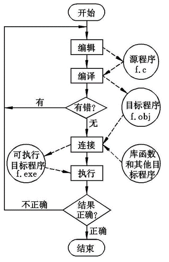
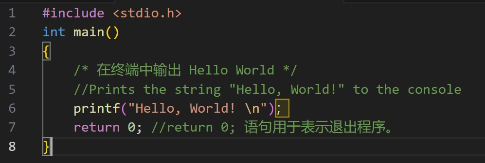
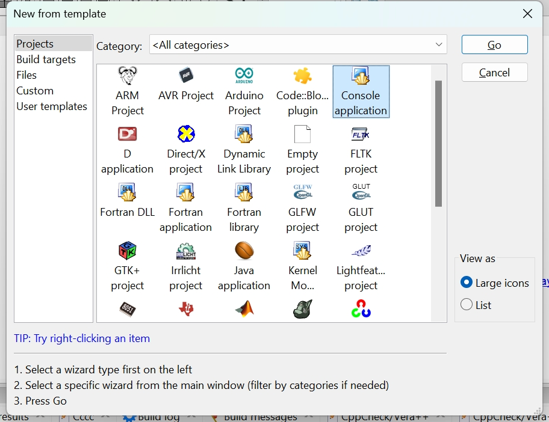
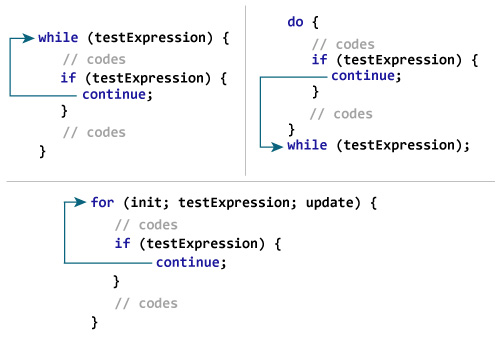
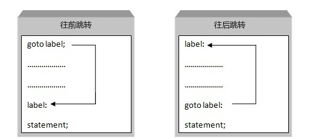
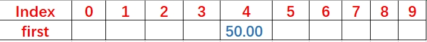

# C语言程序设计

# 1 程序设计语言的基础知识

## 1.1 什么是程序设计语言？

程序设计语言是一种用于编写计算机程序的形式化语言。它定义了一套语法和语义规则，用于描述计算机程序的结构和行为。程序设计语言可以分为低级语言和高级语言两种类型。

低级语言是与计算机硬件直接相关的语言，如机器语言和汇编语言。机器语言是计算机能够直接执行的二进制指令，而汇编语言使用助记符代替机器指令，使程序员更容易编写和理解程序。

高级语言是相对于低级语言而言的，它更接近人类语言，提供了更高的抽象层次和更丰富的功能。高级语言包括C、C++、Java、Python等，它们提供了丰富的库和框架，使得程序开发更加高效和便捷。

通过使用程序设计语言，程序员可以将自己的思想和逻辑转化为计算机可以理解和执行的指令，从而实现各种应用和功能。程序设计语言的选择取决于开发需求、目标平台和个人偏好等因素。

### 1.1.1  机器语言：

在人类控制计算机的过程中，编程语言经历了多个阶段的发展，从最早的机器语言开始。
机器语言是计算机可以直接执行的低级语言。它使用二进制代码表示程序的指令和数据，每条指令对应一个特定的操作，每条数据对应一个特定的存储单元。
最早的机器语言是计算机能够直接理解和执行的二进制指令，曾经使用纸片打孔表示，后来也有用二进制或者十六进制代码的形式表示。

使用`echo`命令和重定向操作符`>`来实现将机器语言代码写入到一个名为`test_program`的文件：

```bash
echo -n -e '\x7f\x45\x4c\x46\x02\x01\x01\x00\x00\x00\x00\x00\x00\x00\x00\x00\x02\x00\x3e\x00\x01\x00\x00\x00\x78\x00\x40\x00\x00\x00\x00\x00\x40\x00\x00\x00\x00\x00\x00\x00\x00\x00\x00\x00\x00\x00\x00\x00\x00\x00\x00\x00\x40\x00\x38\x00\x01\x00\x40\x00\x00\x00\x00\x00\x01\x00\x00\x00\x05\x00\x00\x00\x00\x00\x00\x00\x00\x00\x40\x00\x00\x00\x00\x00\x00\x00\x40\x00\x00\x00\x00\x00\x00\x00\x00\x00\x00\x00\x20\x00\x00\x00\x00\x00\x00\x00\x01\x00\x00\x00\x00\x00\x00\x00\x01\x00\x00\x00\x00\x00\x00\x00\x00\x00\x00\x00\x00\x00\x00\x00\x00\x00\x00\x00\xb8\x3c\x00\x00\x00\x0f\x05' > test_program
```

然后，使用`chmod`命令，将该文件设置为可执行：

```bash
chmod +x test_program
```

最后可以运行该文件：

```bash
./test_program
```

随着计算机技术的发展，机器语言逐渐被淘汰，因为程序员需要编写大量的二进制代码，并且难以阅读和维护。
而且上面的机器语言直接运行几乎必然失败，现在的主流操作系统已经很少支持直接编写和运行机器语言了。

### 1.1.2 汇编语言

为了简化机器语言的编写和阅读，汇编语言应运而生。
汇编语言使用助记符代替了机器指令，使得程序员能够更容易地编写和理解程序。

下面是一个简单的汇编程序，将两个数相加并将结果打印输出：

```ASM
section .data
    message db '1 + 2 = ', 0     ; 定义消息内容，初始值为 '1 + 2 = '
    result db 0                 ; 定义结果变量，初始值为 0
    len equ $-message           ; 计算消息内容的长度

section .text
    global _start

_start:
    ; 设置方程式
    mov eax, 1                 ; 将 1 压入寄存器 eax
    add eax, 2                 ; 将 eax 的值与 2 相加
    mov byte [result], al      ; 将结果存储在 result 变量中

    ; 打印方程式
    mov edx, len              ; 将消息内容的长度存储在 edx 寄存器
    mov ecx, message          ; 将消息内容的地址存储在 ecx 寄存器
    mov ebx, 1                ; 将标准输出的文件描述符 1（stdout）存储在 ebx 寄存器
    mov eax, 4                ; 将系统调用号 4（写入）存储在 eax 寄存器
    int 0x80                  ; 发送系统调用

    ; 将结果转换为可打印字符
    add byte [result], '0'     ; 将结果变量的值加 48（字符 '0' 的ASCII码）

    ; 打印结果
    mov edx, 1                ; 将结果变量的长度存储在 edx 寄存器
    mov ecx, result           ; 将结果变量的地址存储在 ecx 寄存器
    mov ebx, 1                ; 将标准输出的文件描述符 1（stdout）存储在 ebx 寄存器
    mov eax, 4                ; 将系统调用号 4（写入）存储在 eax 寄存器
    int 0x80                  ; 发送系统调用

    ; 退出
    mov eax, 1                ; 将系统调用号 1（退出）存储在 eax 寄存器
    xor ebx, ebx              ; 将退出状态码清零
    int 0x80                  ; 发送系统调用
```

将上面的代码存储成一个名为`test_program.asm`的文件，然后使用`nasm`命令将其编译成机器语言：

```bash
nasm -f elf test_program.asm -o test_program.o
```

再使用`ld`命令将编译后的机器语言文件链接成一个可执行文件：

```bash
ld -m elf_i386 test_program.o -o test_program
```

然后就可以运行这个可执行文件了：

```bash 
./test_program
```

上面的汇编代码是计算1+2并将结果打印到屏幕上的程序。这个程序使用 Linux 系统调用来退出程序。

### 1.1.3. 高级语言

高级语言是相对于机器语言和汇编语言而言的，它更接近人类语言，提供了更高的抽象层次和更丰富的功能。
古典的高级语言包括：

| 语言 | 特点 | 诞生年代 | 当前后继 |
| --- | --- | --- | --- |
|Fortran | 科学计算 | 1957年 | Matlab、Julia、Python | 
|ALGOL | 系统编程 | 1958年 | C、C++、Rust | 
|Lisp | 人工智能 | 1958年 | Matlab、Python | 
|COBOL | 商业统计 | 1959年 | R、Python | 
|Basic | 入门初学 | 1964年 | Python | 


现代的高级语言包括C、C++、Java、Python等，它们提供了丰富的库和框架，使得程序开发更加高效和便捷。
随着时间的推移，硬件性能上的限制逐渐降低了，编程语言的发展越来越注重提高人类的编写效率和代码的可读性，使得程序开发的过程变得更加简洁和高效。

高级语言可以分为编译型和解释型语言，又可以分为指令型和函数型语言，还能分为静态类型和动态类型语言，开发步骤和运行方式也各不相同。


#### 1.1.3.1 Fortran 公式翻译（Formula Translation 的缩写）

1953年，IBM公司开始在IBM704主机上尝试开发一种更实用的语言替换汇编语言；
1954年11月，John Backus 等人完成了草案《IBM数学公式转译系统FORTRAN》；
1957年4月，交付了第一个FORTRAN编译器；
后来 Fortran 成为世界上第一个被正式采用并流传至今的高级编程语言。

#### 1.1.3.2 ALGOL 算法语言（ALGOrithmic Language 的缩写）

ALGOL 开发于 20 世纪 50 年代末；
1958年，ACM小组和以当时联邦德国的应用数学和力学协会（GAMM）在苏黎世把他们关于算法表示法的建议综合为一，先被命名为IAL（国际代数语言，International Algebraic Language），后来改称 Algol 58。
ALGOL 引入了许多现代编程语言仍在使用的概念，如块结构、嵌套函数和递归。ALGOL 对后来编程语言的发展产生了重大影响。

#### 1.1.3.3 CPL 组合编程语言（Combined Programming Language 或者 Cambridge Programming Language 的缩写）
CPL 开发于 20 世纪 60 年代初；
1963年，英国剑桥大学和伦敦大学合作开发出来。
基于 ALGOL 60 ，引入了类型检查的概念，并提供了数组、记录和指针等功能。
CPL 复杂且难以实现，因此后来有了一个简化版本，称为 BCPL。

#### 1.1.3.4 BCPL 基本组合编程语言（Basic Combined Programming Language 的缩写）：
BCPL 开发于 20 世纪 60 年代中期；
1967年，剑桥大学的 Martin Richards 开发出来，是 CPL 的简化版本。
BCPL 引入了 "可移植汇编语言 "的概念，影响了包括 B 和 C 在内的后续编程语言的发展。

#### 1.1.3.5 B语言

B 语言开发于 20 世纪 60 年代末，是 BCPL 的简化版本。
1969年，贝尔实验室的 Ken Thompson 创建，用于 PDP-7 和 PDP-11 计算机的编程。
最开始是准备在UNIX操作系统上开发一个Fortran编译器，后来结合了BCPL的内容，就成了B语言。
B 语言引入了语法简单的高级语言概念，并提供了自动类型转换和动态内存分配等功能，是 C 语言的前身。
```BCPL
LET Sum(a, b) = a + b

LET START() = VALOF $(
    a = 1
    b = 2
    result = Sum(a, b)
    WRITEF("The sum of %I and %I is %I*N", a, b, result)
    RESULTIS 0
$)
```

#### 1.1.3.6 C 语言

C 语言开发于 20 世纪 70 年代初；
丹尼斯-里奇（Dennis Ritchie）在贝尔实验室给DEC PDP-7计算机重写Unix操作系统，使用了B语言的变种。
这个变种就是C语言，是一种系统编程语言，引入了结构化编程、静态类型和通过指针直接操作内存等功能。
在高级抽象和低级控制之间取得了平衡，简洁性和可移植性。

目前，C语言仍然是一种非常流行的编程语言，被广泛应用于系统编程、嵌入式系统、游戏开发等领域。许多其他编程语言，如C++、Objective-C和C#，都是基于C语言的扩展和变体。

C 语言的特点：

* 结构化编程：C语言的程序由语句和声明组成，语句以分号结尾，声明以分号结尾。
* 静态类型：C语言的变量和函数的类型在编译时确定，不能在运行时改变。
* 指针：C语言允许程序员直接操作内存，可以直接访问硬件资源。
* 低级控制：C语言提供了丰富的控制语句和操作符，可以实现复杂的算法和数据结构。
* 可移植性：C语言的代码可以在不同的操作系统和硬件平台上运行，具有良好的可移植性。

上面`1+2=3`过程的 C 语言版本：

```C
#include <stdio.h>

int main() {
    int num1 = 1;
    int num2 = 2;
    num1 += num2;
    printf("%d\n", num1);
    return 0;
}
```

上面的C语言代码将 num1 和 num2 两个数相加，并将结果存储在 num1 中。这个程序使用 printf 函数来输出结果。

#### 1.1.2.7 Python 语言

Python 语言诞生于1989年，由荷兰人 Guido van Rossum 开发，是一种解释型、面向对象、动态数据类型的高级程序设计语言。开发的时候被用来替代Unix Shell和C语言进行脚本编程。

Python 语言的特点：

* 解释型：Python 代码在执行时会被解释器解释，而不是编译成机器语言。
* 面向对象：Python 采用了类和对象的方式来组织代码，这种方式比其他语言更加灵活和高效。
* 动态数据类型：Python 允许程序员在程序运行时改变变量的类型。

上面`1+2=3`过程的Python代码如下：

```Python
num1 = 1
num2 = 2
num1 += num2
print(num1)
```

抽象层次越来越高，代码复杂度越来越低，人类阅读理解和编写也都越来越简洁。

为什么学了Python，还是要学一下C语言呢？

* Python语法简单易学，适合快速开发原型和小型项目；有很多强大的库和框架，可以快速实现各种功能。
* C语言可以直接访问计算机的硬件资源，可实现高效代码，用于系统编程、嵌入式系统和操作系统等领域。

各有各的好处，先都学着了解一下，后续根据需求自行深入探索。

## 1.2 程序开发的步骤

这部分的英语单词需要熟悉，可能以后要常常用到。

| 单词     | 含义 | 解释           |
| -------- | ---- | -------------- |
| Analysis | 分析 | 程序的用途     |
| Design   | 设计 | 如何来实现     |
| Edit     | 编辑 | 具体写代码     |
| Compile  | 编译 | 编译到目标文件 |
| Link     | 链接 | 生成可执行文件 |
| Run      | 运行 | 运行可执行文件 |
| Debug    | 调试 | 修改错误重来   |

Compile 和 Link 这两步骤是针对不同操作系统平台的，生成对应的目标文件和可执行文件。
其他步骤都是跨平台的。
也就是说，同样的一份 C 语言代码，可以在 Windows、Linux、MacOS 平台上编译运行。
代码是完全相同的情况下，不同操作系统上编译出来的目标文件、链接出来的可执行文件各自不同。

### 1.2.1 需求分析

需求分析是程序开发的第一步，也是最重要的一步。
需求分析的目的是得到软件开发的目标，并形成文档。
要写什么样的程序，要做啥事情。

### 1.2.2 设计

设计是程序开发的中间阶段，也是最重要的阶段。
设计是程序开发的关键，设计的好坏直接影响程序的性能和开发周期。
怎么去做到，如何来实现。

### 1.2.3 编码

编码是程序开发的最核心阶段，也是最耗时和最困难的一步。
编码阶段，需要程序员对程序进行编码，包括程序的编写和测试。
按照设计一步步编写代码，从人类语言转化为程序设计语言。

### 1.2.4 编译、链接、运行、调试

源代码（source code） → 预处理（preprocessor） → 编译器（compiler） → 汇编程序（assembler） → 目标代码（object code） → 链接器（Linker） → 可执行文件（executables）

编译器读取源代码，编译出来目标文件，再由链接器链接成可执行文件。
可执行文件就能拿来运行，若有错误就进行修改，这个过程比较容易出错，需要调试。



## 1.3 语言的特性

使用程序设计语言所写的代码只是文本，在机器上运行有很多种方式。

* 编译型语言，是先翻译成机器语言，再由机器执行。C、C++，Swift，Go
* 解释型语言，是先翻译成机器语言，再由机器逐行解释执行。Python、JavaScript
* 混合型语言，将源代码转换为机器代码，然后在一个环境中执行机器代码。C#，Java，Scala，Kotlin

C语言是编译型语言。

### 1.3.1 访问范围广

* 可访问物理内存的语言：C、C++、Rust
* 只可访问堆的语言：C#、JavaScript
* 只可访问栈的语言：Java、Python

堆和栈都是计算机内存的一部分。
堆的分配和释放需要由开发者手动完成。
栈的分配和释放是由编译器自动完成的。

能访问物理内存的语言，适合操作系统以及驱动程序的开发。
这些任务 Python 很难胜任。

### 1.3.2 运行速度

* 静态类型语言：变量的类型必须在编译时确定，先声明，后使用；
* 动态类型语言：变量的类型可以在运行时确定，随时用，可更改。

C语言是静态类型语言，速度快。
Python是动态类型语言，速度慢。

##### 思考题 1 同样功能的代码，C语言实现的一定比Python的快么？一直都是这样么？考虑一下版本和不同场景。

### 1.3.3 跨平台性

C语言被当今几乎所有主流操作系统所支持；
C语言编写的程序基本可以运行在任何操作系统上。

## 1.4 环境搭建

工欲善其事必先利其器，先把开发环境构建起来吧。

### 1.4.1 硬件设备选择

C语言是运行在计算机上的程序语言，所以需要一台计算机。
低配置的笔记本电脑，或者台式机都可以。
当然了，要开发高性能需求的应用，或者想有比较好的体验，需要使用高性能的计算机。

C语言支持多种指令集的处理器，

* 32位处理器：x86、ARM、MIPS
* 64位处理器：x86_64、ARM64、MIPS64

32位处理器有什么劣势？

+ 32位架构下，最大寻址空间是4GB，这是怎么算出来的？2^32 = 32 Gb = 4GB
+ 当然，后来有了内存地址扩展（PAE，Physical Address Extension）。

1 Byte = 8 bit
1 KB = 1024 Byte
1 MB = 1024 KB
1 GB = 1024 MB
1 TB = 1024 GB
1 PB = 1024 TB
1 EB = 1024 PB
1 ZB = 1024 EB
1 YB = 1024 ZB

##### 思考题 2 32位处理器不考虑PAE的情况下能够访问的最大内存是多少？列出计算过程。

现代的比较新的笔记本电脑、台式机，以及手机，基本都是64位处理器了。
因此本课程推荐大家使用主流的64位处理器。

### 1.4.2 操作系统选择

C语言是运行在操作系统上的程序语言，所以需要选择一个操作系统。
常见的操作系统有哪些？

* 个人电脑（Personal Computer）：Windows、GNU/Linux、macOS
* 服务器（Server）：GNU/Linux、BSD
* 移动设备：iOS、Android
* 嵌入式系统（Embedded System）：GNU/Linux、RTOS

大家的电脑上安装的操作系统一般是：

* Windows：驱动相对完善，软件生态极度繁荣，适合日常场景。
* GNU/Linux：开源，免费，适合本地开发场景。
* macOS：平台独占，适合影音媒体创作场景。

大家之前可能也接触过 GNU/Linux 操作系统，而且以后的开发工作难免要以 GNU/Linux 操作系统作为开发环境。
因此本课程推荐大家使用 GNU/Linux 操作系统。

具体的发行版方面，推荐使用 Ubuntu 22.04.3 LTS，这个发行版的硬件驱动支持和软件生态都相对完善。

当然了，Windows 和 macOS 也可以用于咱们这门课，只是尽量多接触 GNU/Linux 的开发生态，对大家以后熟练上手有帮助。

### 1.4.3 编译器选择

C语言是编译型语言，需要编译成目标文件，然后再由链接器生成可执行文件，所以需要选择一个编译器（Compiler）。
编译器是C语言开发环境的核心组件，现在主流的 C 语言编译器包括：

* Visual C++：微软的编译器，最初集成于 Visual Studio 之中，现在也开始支持其他平台。
* Clang：Clang是LLVM（Low Level Virtual Machine 缩写）的编译器，最初为macOS设计，现在支持多平台。
* GNU GCC：GNU编译器集合，支持多种处理器架构，支持多种编程语言，支持多种操作系统。
* 其它：其它一些编译器，比如IAR、Keil、TinyCC等。

以前的很多教材和课程都推荐大家用 Visual C++，涉及到很多Visual Studio 的相关内容，比如如何新建工程等等，这些对于初学C语言来说过于琐碎。

本课程推荐大家使用 GCC 编译器。

GCC 是一个套件，实际上包含了编译器和链接器等全套工具了。

* 编译器负责将C语言源文件编译成目标文件（在Windows下扩展名通常位obj）；
* 链接器负责将目标文件链接成可执行文件（在Windows下扩展名通常为exe）。

不同的编译器对同样的 C 语言代码编译后，运行结果可能会有差异。
因为不同的编译器可能会对代码进行不同的优化，或者在实现标准方面存在细微的差异。
不同的编译器可能会使用不同的库或版本，这也可能会导致运行结果的差异。

在编写 C 代码时，最好使用符合 ANSI C 标准的代码，以确保代码在不同的编译器和平台上都能够正确编译和运行。

##### 思考题 3 建议大家在学习本课程中都是用GCC作为编译器，这样会有什么好处？

### 1.4.4 GCC 的安装与使用

Windows 下可以通过[MinGW](https://www.mingw-w64.org/downloads/#w64devkit)来安装GCC，但实际上还有更方便的途径，后面讲集成开发环境再说。

macOS 下可以通过 包管理器 HomeBrew 安装 GCC，命令如下：

```Bash
user@macos:~$ brew install gcc
```

Linux 下安装 GCC 很简单方便，直接用包管理器安装即可。
Ubuntu 下可以通过 apt 命令安装 GCC，命令如下：

```Bash
user@linux:~$ sudo apt install build-essential 
```

安装完成后，在终端中输入 `gcc --version` 命令，若看到类似下面的输出，就说明安装成功了：

```Bash
user@linux:~$ gcc --version
gcc (Ubuntu 11.3.0-1ubuntu1~22.04) 11.3.0
Copyright (C) 2021 Free Software Foundation, Inc.
This is free software; see the source for copying conditions.  There is NO
warranty; not even for MERCHANTABILITY or FITNESS FOR A PARTICULAR PURPOSE.   
```

GCC 使用非常简便，就像下面这样：

```Bash
user@linux:~$ ls # list的意思，这是列表显示当前目录下的文件
hello.c
user@linux:~$ cat hello.c # cat是显示的意思，这是显示hello.c的内容
#include <stdio.h>
int main() 
{
    /* 在终端中输出 Hello World */
    //Prints the string "Hello, World!" to the console
    printf("Hello, World! \n");
    return 0;
}
user@linux:~$ gcc hello.c # gcc是编译的意思，这是将hello.c编译出来
user@linux:~$ ls # 再次列表显示，看到按照默认配置会生成的一个a.out文件
a.out  hello.c
user@linux:~$ ./a.out # ./是当前路径的意思，这里是执行a.out文件
Hello, World! # 终端显示Hello, World!代码执行成功
user@linux:~$ gcc hello.c -o hello # 这里是使用-o参数指定生成的可执行文件名
user@linux:~$ ls # 再次列表显示，看到生成了一个hello文件
a.out  hello  hello.c 
user@linux:~$ ./hello # 这里执行的是hello文件，终端显示
Hello, World! # 代码执行成功
```

### 1.4.4 编辑器选择

编辑器，直观来解释，就是咱们编辑源代码文件输入代码的工具。
编辑器有很多种，有的是操作系统自带的，还有的需要额外安装。
大家以前肯定都用过诸如记事本之类的软件吧？记事本就是一个编辑器。
开发领域常见的编辑器有以下这些：

* Vi/Vim 效率高强，无需鼠标，非常经典；
* Emacs 功能强大，扩展丰富，也非常经典；
* Nano 非常轻量级，支持多种操作系统；
* Sublime Text 跨平台，支持多种操作系统，功能强大，但收费；
* Atom 跨平台，支持多种操作系统，功能强大，开源免费；
* Visual Studio Code 跨平台，支持多种操作系统，功能强大，开源免费；
* Visual Studio Codium 跨平台，支持多种操作系统，功能强大，开源免费。

还有很多其他的编辑器，此处不一一赘述。
本课程推荐使用 Visual Studio Code 或者 Visual Studio Codium。

在一些低能耗场景，比如路由器操作系统 OpenWRT、树莓派操作系统 Raspbian 等，可能没有图形界面，只能使用命令行界面，此时推荐使用 Nano。

### 1.4.5 集成开发环境

集成开发环境，英文缩写为IDE（Integrated Development Environment），简称 IDE。
这个和硬盘接口有一个IDE可不一样哈。
集成开发环境，就是专门用来开发软件的软件。
常见的C语言集成开发环境有：

* Visual Studio 微软的，有免费版本，功能强大，支持多种操作系统，但太臃肿；
* Eclipse 跨平台，支持多种操作系统，支持多种编程语言，功能强大，开源免费；
* Qt Creator 用于Qt应用程序开发，支持C、C++，跨平台，支持多种操作系统，功能强大，开源免费；
* Code::Blocks 安装和使用简单，轻量级，跨平台，支持多种操作系统，功能强大，开源免费。

还有一些其他的集成开发环境，此处不一一赘述。
本课程推荐使用 [Code::Blocks](https://www.codeblocks.org/downloads/binaries/) 作为集成开发环境。

实际上，IDE 只是一个软件，它和编辑器一样，都是用来编辑源代码文件的。
只要熟悉了编辑器的基本使用，就足以应对本课程的相关内容了。

不过，对于Windows用户来说，下载安装集成了 MingW 的 Code::Blocks，可以一站式完成配置，更加方便。

集成开发环境往往可以提供一些复杂工程的构建和管理等方面的援助，而且还有一些关键词自动补充之类的辅助功能。
不过近年来随着copilot、codegeex之类基于大语言模型的人工智能编程助手的出现，情况已经有所改变。
在Visual Studio Code、Vim等编辑器中集成AI编程助手，甚至直接使用AI编程助手进行编程，已经非常方便了。
但总体来看，集成开发环境的文档还是更齐全一些，适应场景也更丰富。

##### 思考题 4 使用编辑器+编译器的方式，和使用集成开发环境相比，各有什么优劣？

# 2 初步体验C语言

## 2.1 从文本开始

源程序，一般都是文本文档。
从源程序，编译出目标文件，然后链接出可执行文件，最终才能运行。
C语言的源程序，一般都以`.c` 结尾。
C语言的编译器，推荐使用 `gcc`。
C语言的可执行文件，一般都以`.out` 结尾。
对于一个C语言程序来说，一切的起点就是这个扩展名为`.c`的文本文件了。

### 2.1.1 字符编码

如果只用键盘上的字符，那使用ASCII编码就可以了。
ASCII（American Standard Code for Information Interchange）是由美国国家标准学会（American National Standard Institute，ANSI）制定的，使用标准的单字节字符编码方案，用于基于文本的数据。方案起始于50年代后期，在1967年定案。

ASCII编码是从电报码发展来的（向前兼容），所以里面还有一些关于响铃和文本传输起点终点之类的控制字符，其第一版本标准发布于1963年，最后的更新版本是1986年。

| ASCII码 | 字符 | ASCII码 | 字符 |
|--------|----------|--------|----------|
| 65     | A        | 97     | a        |
| 66     | B        | 98     | b        |
| 67     | C        | 99     | c        |
| 68     | D        | 100    | d        |
| 69     | E        | 101    | e        |
| 70     | F        | 102    | f        |
| 71     | G        | 103    | g        |
| 72     | H        | 104    | h        |
| 73     | I        | 105    | i        |
| 74     | J        | 106    | j        |
| 75     | K        | 107    | k        |
| 76     | L        | 108    | l        |
| 77     | M        | 109    | m        |
| 78     | N        | 110    | n        |
| 79     | O        | 111    | o        |
| 80     | P        | 112    | p        |
| 81     | Q        | 113    | q        |
| 82     | R        | 114    | r        |
| 83     | S        | 115    | s        |
| 84     | T        | 116    | t        |
| 85     | U        | 117    | u        |
| 86     | V        | 118    | v        |
| 87     | W        | 119    | w        |
| 88     | X        | 120    | x        |
| 89     | Y        | 121    | y        |
| 90     | Z        | 122    | z        |


2的七次方可以表示为数学公式：2^7 = 128
ASCII使用7位二进制数表示128个字符，包括英文字母、数字和一些特殊字符，此外无法表示其他字符。
一个字节（Byte）有多少个比特（Bit）来着？

一个字节如果不够，那就多加一些？
如果要表达更多的字符，就需要使用更复杂的编码了。

GBK 用两个字节编码字符：
GBK全称《汉字内码扩展规范》（GBK即“国标”、“扩展”汉语拼音的第一个字母，英文名称：Chinese Internal Code Specification），是中文字符集编码方式，它使用2个字节表示一个中文字符，可以表示常用的中文字符。

GBK表示中文很好用了，可如果要用其他语言的字符，该怎么办？

UTF-8 使用一至四个字节编码字符，其中对汉字使用用三个字节编码，
UTF-8 全称 Unicode Transformation Format-8，是一种可变长度的Unicode编码方式，它可以表示全球范围内的字符，根据字符的不同范围使用不同长度的字节表示，英文字符使用1个字节表示，中文字符使用3个字节表示。


总结起来，ASCII编码只能表示英文字符，而GBK编码主要用于表示中文字符，UTF-8 可以表示全球范围内的字符，是目前互联网上最常用的字符编码方式。

推荐大家使用UTF-8编码，一方面是字符基本足够，另一方面是业界通用。

### 2.1.2 标点符号


初学者常犯的错误，就是在代码中使用中文标点符号。
C语言以及其他很多编程语言当中的标点符号，都必须是英文标点符号。
这并没有什么太明确的道理，只是一种沿袭。

| 英文标点符号 | 中文标点符号 |
|--------------|--------------|
|.            | 。           |
|,            | ，           |
| ;            | ；           |
| :            | ：           |
|?            | ？           |

现在的开发工具都设计得很完善，如果遇到符号错误，有的编辑器或者集成开发环境都会提示。



有时候还可能遇到编译器的报错信息。
比如`error: expected ';' before '}' token`之类的。
这些报错信息，看到了就一个个查单词弄明白说的是什么。
不要一遇到外语单词就举手投降找老师求助或者放挺。


## 2.2 第一个程序

第一个程序，一般都是 Hello World。

```C
#include <stdio.h>
int main()
{
    /* 在终端中输出 Hello World */
    //Prints the string "Hello, World!" to the console
    printf("Hello, World! \n"); 
    return 0; //return 0; 语句用于表示退出程序。
}
```

C 语言程序代码每一行末尾要加分号`;`。
所有的 C 语言程序都需要包含 `main()` 函数。
代码从 `main()` 函数开始执行。
上面的 `/* ... */`用于注释说明。
`printf()` 用于格式化输出到屏幕。
`printf()` 函数在 `stdio.h` 头文件中声明。
`stdio.h` 是一个头文件 (标准输入输出头文件) 。
`#include` 是一个预处理命令，用来引入头文件。
编译器遇到 `printf()` 函数时，若没找到 `stdio.h` 头文件，会发生编译错误。

上面代码保存成一个 `hello.c` 的文件，用 `gcc` 编译出来，就可以运行了。

```Bash
user@linux:~$ gcc hello.c # gcc是编译的意思，这是将hello.c编译出来
user@linux:~$ ls # 再次列表显示，看到按照默认配置会生成的一个a.out文件
a.out  hello.c
user@linux:~$ ./a.out # ./是当前路径的意思，这里是执行a.out文件
Hello, World! # 终端显示Hello, World!代码执行成功
user@linux:~$ gcc hello.c -o hello # 这里是使用-o参数指定生成的可执行文件名
user@linux:~$ ls # 再次列表显示，看到生成了一个hello文件
a.out  hello  hello.c 
user@linux:~$ ./hello # 这里执行的是hello文件，终端显示
Hello, World! # 代码执行成功
```

##### 思考题 5 使用 GCC 编译一份名为 code.c 的C语言代码文件，指定生成名为 code 的可执行文件，命令是什么？

## 2.3 性能对比

### 2.3.1 C语言一定总是比Python快么？

下是一个更复杂的例子，它将使用C语言和Python计算斐波那契数列的前1000个数字：

C语言代码：

```C
// 斐波那契数列 
#include <stdio.h>
#include <time.h>

int main() {
    // 定义变量n，表示要输出多少个斐波那契数列
    int n = 100, i, t1 = 0, t2 = 1, nextTerm;
    // 输出提示信息
    printf("Fibonacci Series: ");

    // 记录开始时间
    clock_t start = clock();
    // 循环输出斐波那契数列
    for (i = 1; i <= n; ++i) {
        // 输出斐波那契数列的值
        printf("%d, ", t1);
        // 计算下一个斐波那契数列的值
        nextTerm = t1 + t2;
        // 更新t1和t2的值
        t1 = t2;
        t2 = nextTerm;
    }
    // 记录结束时间
    clock_t end = clock();

    // 计算程序运行的时间
    double time_spent = (double)(end - start) / CLOCKS_PER_SEC;
    // 输出程序运行的时间
    printf("\nTime taken: %f seconds\n", time_spent);

    return 0;
}
```

输出如下：

```Bash
Fibonacci Series: 0, 1, 1, 2, 3, 5, 8, 13, 21, 34, 55, 89, 144, 233, 377, 610, 987, 1597, 2584, 4181, 6765, 10946, 17711, 28657, 46368, 75025, 121393, 196418, 317811, 514229, 832040, 1346269, 2178309, 3524578, 5702887, 9227465, 14930352, 24157817, 39088169, 63245986, 102334155, 165580141, 267914296, 433494437, 701408733, 1134903170, 1836311903, -1323752223, 512559680, -811192543, -298632863, -1109825406, -1408458269, 1776683621, 368225352, 2144908973, -1781832971, 363076002, -1418756969, -1055680967, 1820529360, 764848393, -1709589543, -944741150, 1640636603, 695895453, -1958435240, -1262539787, 1073992269, -188547518, 885444751, 696897233, 1582341984, -2015728079, -433386095, 1845853122, 1412467027, -1036647147, 375819880, -660827267, -285007387, -945834654, -1230842041, 2118290601, 887448560, -1289228135, -401779575, -1691007710, -2092787285, 511172301, -1581614984, -1070442683, 1642909629, 572466946, -2079590721, -1507123775, 708252800, -798870975, -90618175, -889489150, 
Time taken: 0.004000 seconds
```

##### 思考题 6 为什么C语言版本的斐波那契数列从 2144908973 往后的突然变成负数了？

Python代码：

```Python
import time

# 定义变量n，赋值为100
n = 100
# 定义变量t1，t2，赋值为0，1
t1, t2 = 0, 1
# 打印字符串，end=" "表示打印空格
print("Fibonacci Series: ", end=" ")
# 记录开始时间
start = time.time()
# 循环n次，每次打印t1，t2，t1+t2赋值给t2
for i in range(n):
    print(t1, end=" ")
    nextTerm = t1 + t2
    t1 = t2
    t2 = nextTerm
# 记录结束时间
end = time.perf_counter()

# 计算时间差
time_spent = end - start
# 打印时间差，单位为秒
print("\nTime taken: ", time_spent, " seconds")
```

输出如下：

```Bash
Fibonacci Series:  0 1 1 2 3 5 8 13 21 34 55 89 144 233 377 610 987 1597 2584 4181 6765 10946 17711 28657 46368 75025 121393 196418 317811 514229 832040 1346269 2178309 3524578 5702887 9227465 14930352 24157817 39088169 63245986 102334155 165580141 267914296 433494437 701408733 1134903170 1836311903 2971215073 4807526976 7778742049 12586269025 20365011074 32951280099 53316291173 86267571272 139583862445 225851433717 365435296162 591286729879 956722026041 1548008755920 2504730781961 4052739537881 6557470319842 10610209857723 17167680177565 27777890035288 44945570212853 72723460248141 117669030460994 190392490709135 308061521170129 498454011879264 806515533049393 1304969544928657 2111485077978050 3416454622906707 5527939700884757 8944394323791464 14472334024676221 23416728348467685 37889062373143906 61305790721611591 99194853094755497 160500643816367088 259695496911122585 420196140727489673 679891637638612258 1100087778366101931 1779979416004714189 2880067194370816120 4660046610375530309 7540113804746346429 12200160415121876738 19740274219868223167 31940434634990099905 51680708854858323072 83621143489848422977 135301852344706746049 218922995834555169026 
Time taken:  0.00033409999741706997  seconds
```

很多教科书上都说，C语言快、Python慢。但是，随着Python的版本演进，有的时候Python未必比C慢。
具体的速度，不仅仅看编程语言本身，还要看使用的场景和代码编写方式等等。

### 2.3.2 尽信书不如无书

时代发展很快，技术更新很快，很多书籍出版出来的时候，内容就已经落伍了。
以前有的书上只说C语言可以写驱动和操作系统内核。
实际上现在已经有很多驱动和操作系统内核部分是使用RUST语言来写了。

不要迷信任何权威。
若过了很多年，关于这门课你已经没有太多印象了，我希望你还至少能记得这一点。
代码是最公正的，拿来运行，直接出结果。

## 2.4 代码的注释和规范

机器看的部分，自然就是代码本体。
人看的部分，一般就是注释。
上面的C语言代码中，注释的形式是用 `//`,这是单行的注释。
多行的注释有的是下面这样子的：

```C
    /*多行的代码
    可以这样注释掉*/
```

实际上你根本不用费劲去记忆哪个是第一种方式，哪个是第二种方式。
在 VS Code 之类的编辑器里面，直接都用 `CTRL+/`之类的快捷键来添加注释了。
甚至有了CodeGeex之类的AI代码生成工具，只写代码主体，然后用AI代码生成工具可以自动生成注释。

但无论如何，你的代码都应该有注释。
要不然可能过了没多久，一天两天，甚至一两分钟之后，你都可能忘了代码里面有些什么东西。

代码的规范，主要是指代码的格式。
对C语言的代码，不同的开源组织、开发项目、开源社区，甚至不同的公司，都有不同的规范。
大家尽量先照着课程样例代码来尝试着修改。
等以后参与具体的开发的时候，再找对应的复杂的代码规范来遵守。

##### 思考题 7 C语言代码若不加任何注释，可能会有什么不良影响？

# 3 C语言代码的结构

C语言代码，其实就是一个函数的集合体。
函数若太多了，代码就不好维护。
所以就拆分出来一些，放到头文件里面。
而每一个头文件，尽量就只负责一个类别的函数集合。
本章就顺着这样的思路，来学习C语言代码的结构。

## 3.1 函数的声明和定义

什么是函数？
函数是C语言里面最基本的代码单元。
能够复用的代码块，或者具有特定功能的代码集合体，都可以写成函数。

函数是做什么用的呢？
其实和数学里差不多，接收若干个变量，然后给出一个结果，就这么简单。
不过编译器不一定那么聪明，而且编程语言都有规则限制，所以函数的声明和定义，需要写清楚。

函数的声明和定义，可以写在一起，也可以分开。
只是一定要记住，先声明，再定义，然后才能使用。

声明，就是告诉编译器有一个什么名字的函数，接收几个什么样的参数，返回什么样的结果。
定义，就是告诉编译器这个函数内部的具体运算过程。

比如，`hello.c`里面的 `hello_world`函数，它的声明和定义如下：

```C
#include <stdio.h> // 预处理命令，包含一下 stdio.h 文件，用<>就表明从系统库中寻找头文件
#include "tools.h" // 预处理命令，包含一下 tools.h 文件，用""就表明从当前目录寻找头文件，但这个头文件其实在这个代码中并没有使用
int main() // 函数的声明，告诉编译器有一个名字叫做main的函数，接收0个参数，返回int类型
{ // 函数的定义，告诉编译器这个函数内部的具体运算过程
    /* 在终端中输出 Hello World */
    //Prints the string "Hello, World!" to the console
    printf("Hello, World! \n");  // 打印输出对应文字
    return 0; // 返回一个int类型的值，0表示成功
}
```

`stdio.h`是系统库中包含的标准输入输出头文件，`tools.h`是当前目录下包含的另一个头文件。
函数的声明，以前经常用 `void`来表示返回值类型，表示没有返回值。
而现在一般不建议这么做，建议用 `int`来表示返回值类型，若正常运行结束就让返回0。
函数的定义，一般用 `{ }`来表示函数体，表示函数内部的运算过程。
函数的参数，一般括号里面空白就表示没有参数。

##### 思考题 8 C语言代码里都用的英文的半角标点符号，若换成中文的标点符号会如何？

## 3.2 头文件、包含关系

上面咱们试着体验过的 `hello.c`，以及后面大家要尝试写的一些单个的C语言代码，都是简单形态的。
实际上开发过程中，难以避免要使用复杂的包含关系。
一个C语言源代码文件中，可能要包含若干个头文件，头文件里面又包含了其他头文件。
比如，名为 `code.c`的一个文件，里面要包含 `tools.h`的头文件，而 `tools.h`里面又包含了 `stdio.h`的头文件。

为什么要包含头文件呢？
因为头文件里面包含了C语言的函数声明，而C语言的函数声明，是C语言源代码文件中的一部分。

以 `stdio.h`为例，头文件里面已经写好了很多非常基础又可能非常常用的函数。
对于这类函数就没必要重新造轮子，直接拿来用就好了。

### 3.2.2 无返回的调用

首先是一个名为 `tools.h`的头文件：

```C
#ifndef TOOLS_H
#define TOOLS_H
#include <stdio.h>
// 打印一个数字的所有因子
void print_factors(int n) {
    // 打印提示信息
    printf("The factors of %d are: ", n);
    // 遍历所有因子
    for (int i = 1; i <= n; ++i) {
        // 若因子存在，则打印出来
        if (n % i == 0) {
            printf("%d ", i);
        }
    }
    // 打印换行符
    printf("\n");
}
#endif
```

然后是一个名为 `code.c`的源代码：

```C
#include <stdio.h> // 预处理命令，包含一下 stdio.h 文件，用<>就表明从系统库中寻找头文件
#include "tools.h" // 预处理命令，包含一下 tools.h 文件，用""就表明从当前目录寻找头文件

int main() {
    // 定义一个变量n，用于存储一个正整数
    int n;
    // 打印出提示信息，让用户输入一个正整数
    printf("Enter a positive integer: ");
    // 使用scanf函数读取用户输入的正整数
    scanf_s("%d", &n);
    // 调用print_factors函数，打印出正整数的因子
    print_factors(n);
    return 0;
}
```

最后编译 `code.c`并运行：

```Bash
user@linux:~$ gcc code.c -o code  
user@linux:~$ ./code          
Enter a positive integer: 34
The factors of 34 are: 1 2 17 34 
```

### 3.2.3 有返回的调用

首先是一个名为 `tools2.h`的头文件：

```C
#include <stdlib.h>

// 计算一个数的所有因子
int* get_factors(int n, int* num_factors) {
    // 分配一个数组，用于存储因子
    int* factors = (int*) malloc(n * sizeof(int));
    // 记录因子个数
    int count = 0;
    // 从1开始，到n结束，每次循环加1
    for (int i = 1; i <= n; ++i) {
        // 若n能被i整除，则将i记录到factors中
        if (n % i == 0) {
            factors[count++] = i;
        }
    }
    // 将因子个数记录到num_factors中
    *num_factors = count;
    // 返回因子数组
    return factors;
}
```

然后是一个名为 `code2.c`的源代码：

```C
#include <stdio.h>  // 预处理命令，包含一下 stdio.h 文件，用<>就表明从系统库中寻找头文件
#include <stdlib.h> // 预处理命令，包含一下 stdlib.h 文件，用<>就表明从系统库中寻找头文件
#include "tools2.h" // 预处理命令，包含一下 tools2.h 文件，用""就表明从当前目录寻找头文件

int main() {
    // 定义一个整型变量n
    int n;
    // 打印提示信息，让用户输入一个正整数
    printf("Enter a positive integer: ");
    // 读取用户输入的正整数
    scanf("%d", &n);
    // 定义一个整型变量num_factors，用于存储因子个数
    int num_factors;
    // 调用函数get_factors，获取因子，并存储在变量factors中
    int* factors = get_factors(n, &num_factors);
    // 打印提示信息，让用户知道因子
    printf("The factors of %d are: ", n);
    // 遍历变量factors，打印每一个因子
    for (int i = 0; i < num_factors; ++i) {
        printf("%d ", factors[i]);
    }
    printf("\n");
    // 调用函数free，释放变量factors占用的内存空间
    free(factors);
    return 0;
}
```

最后编译 `code2.c`并运行：

```Bash
user@linux:~$ gcc code2.c -o code2  
user@linux:~$ ./code2          
Enter a positive integer: 34
The factors of 34 are: 1 2 17 34 
```

### 3.3 复杂工程项目

实际开发过程中，工程项目非常复杂，要根据具体的情况来编写代码，确定文件结构。
有的工程可能需要多个源文件，有的工程可能需要多个头文件，有的工程可能需要多个库文件。


有的开发团队还提供了专门的文档，大家到时候严格依照文档来撰写，就可以了。

# 4 C语言的基本数据类型

## 4.1 基本类型

### 4.1.1 整型

C语言中，整型数据包括 `char`、`short`、`int`、`long`。
每一种还分为有符号（signed）和无符号（unsigned）两种。
默认的都是有符号的。

|      类型      |  存储大小  |                       取值范围                       |
| :------------: | :---------: | :--------------------------------------------------: |
|      char      |   1 字节   |               -128 到 127 或 0 到 255               |
| unsigned char |   1 字节   |                       0 到 255                       |
|  signed char  |   1 字节   |                     -128 到 127                     |
|      int      | 2 或 4 字节 | -32,768 到 32,767 或 -2,147,483,648 到 2,147,483,647 |
|  unsigned int  | 2 或 4 字节 |          0 到 65,535 或 0 到 4,294,967,295          |
|     short     |   2 字节   |                  -32,768 到 32,767                  |
| unsigned short |   2 字节   |                     0 到 65,535                     |
|      long      |   4 字节   |           -2,147,483,648 到 2,147,483,647           |
| unsigned long |   4 字节   |                  0 到 4,294,967,295                  |

##### 思考题 9 `char`是字符，但实际上是整数，这是怎么回事呢？

`char` 变量在内存中存储的是字符对应的ASCII 码值。
若以%c 输出，会根据ASCII码表转换成对应的字符；
若以%d 输出，那么还是整数。

`int`变量在内存中存储的是整数本身；
若以%c 输出时，也会根据ASCII码表转换成对应的字符。

```C
#include <stdio.h> 
int main()
{
    // 输出数字97
    printf("%d\n", 97);     // 97
    // 输出字符a
    printf("%c\n", 97);     // a
    // 输出字符a的ASCII码
    printf("%d\n", 'a');    // 97
    // 输出字符a
    printf("%c\n", 'a');    // a
}
```

运行结果如下所示：

```Bash
97
a
97
a
```

### 4.1.2 浮点型

C语言中，浮点型数据包括单精度 `float`和双精度 `double`、长双精度 `long double`。

|    类型    | 存储大小 |         值范围         |    精度    |
| :---------: | :------: | :--------------------: | :---------: |
|    float    |  4 字节  |   1.2E-38 到 3.4E+38   | 6 位有效位 |
|   double   |  8 字节  |  2.3E-308 到 1.7E+308  | 15 位有效位 |
| long double | 16 字节 | 3.4E-4932 到 1.1E+4932 | 19 位有效位 |

##### 思考题 10 float 使用了 4 个字节，double 使用了 8 个字节，long double 使用了 16 个字节，为了精确，是不是总是应该用最长的类型？

为了得到某个类型或某个变量在特定平台上的准确大小，可以使用 sizeof 运算符。
表达式 sizeof(type) 得到对象或类型的存储字节大小。
下面的代码演示了获取多个类型的大小：

```C
#include <stdio.h> 
int main()
{
   printf("当前平台 int 类型的大小是 : %lu \n", sizeof(int));   
   printf("当前平台 char 类型的大小是 : %lu \n", sizeof(char));
   printf("当前平台 short 类型的大小是 : %lu \n", sizeof(short));
   printf("当前平台 long 类型的大小是 : %lu \n", sizeof(long));
   printf("当前平台 float 类型的大小是 : %lu \n", sizeof(float));
   printf("当前平台 double 类型的大小是 : %lu \n", sizeof(double));
   return 0;
}
```

运行结果如下所示：

```Bash
当前平台 int 类型的大小是 : 4 
当前平台 char 类型的大小是 : 1 
当前平台 short 类型的大小是 : 2 
当前平台 long 类型的大小是 : 4 
当前平台 float 类型的大小是 : 4 
当前平台 double 类型的大小是 : 8
```


## 4.2 数据类型的应用场景

在机器学习和科学计算等领域，不同的数值类型有各自的应用，主要取决于计算的精度需求、内存和存储限制、以及计算效率等因素。

- 整数（Integer）：用于表示离散的数值，如计数、索引或标签编码等。在机器学习的分类问题中，我们可以使用整数来表示不同的类别。

- 浮点数（Float）：用于表示连续的数值，常用于科学计算，可以表示非常大或非常小的数值，以及小数。在机器学习中，特征向量、模型参数、损失函数的值等通常都是浮点数。

- 定点数（Fixed-point）：在需要精确控制数值精度的场合中有用，例如在金融计算或嵌入式系统中。在某些硬件上，定点数的运算比浮点数更快，因此在对计算效率有严格要求的场合，如实时机器学习应用，可能会使用定点数。

- 复数（Complex）：用于表示和计算复平面上的数值。在科学计算中，特别是在处理信号处理、量子物理、电路设计等领域，复数是必不可少的。

- 布尔值（Boolean）：用于表示二值逻辑，如真/假或是/否。在机器学习中，布尔值可以用于表示二分类问题的输出，或者用于创建和处理条件掩码。

- 大数（Big Numbers）：在需要处理超出标准数值类型范围的大数值时，如在加密或高精度计算中，可能需要使用大数类型。

不同的编程语言可能提供不同的数值类型，以及对应的数值运算和处理函数。在实际应用中，选择哪种数值类型取决于具体的需求和约束。

## 4.3 类型转换

C 语言提供了两种类型转换：

- 隐式类型转换：编译器在编译器执行类型转换，程序员无需进行显示转换。
- 显式类型转换：编译器不会执行类型转换，程序员需要进行显示转换。

```C
#include <stdio.h> 
int main()
{
    // 定义变量a，类型为int，赋值为10
    int a = 10;
    // 定义变量b，类型为float，赋值为3.14
    float b = 3.14;
    // 定义变量c，类型为double，将a和b相加
    double c = a + b; // 隐式将int类型转换为double类型

    // 定义变量d，类型为double，赋值为3.14159
    double d = 3.14159;
    // 将d转换为int类型，赋值给e
    int e = (int)d; // 显式将double类型转换为int类型
    // 打印变量c和e的值
    printf("c = %f \ne = %d\n", c, e);
    return 0;
}
```

上面代码的运行结果为：

```Bash
c = 13.140000 
e = 3
```

## 4.4 动态类型与静态类型

动态类型语言和静态类型语言的主要区别在于类型检查的时间：

- **静态类型语言**：在编译时进行类型检查。写代码时必须明确每个变量的类型。如果你试图将错误的类型赋值给变量，编译器会在编译时报错。C、C++、Java和Go等都是静态类型语言。

- **动态类型语言**：在运行时进行类型检查。写代码时不需要明确每个变量的类型。如果你试图进行不兼容的类型操作，程序会在运行时报错。Python、Ruby、JavaScript和PHP等都是动态类型语言。

静态类型语言和动态类型语言各有优势和劣势：

- **静态类型语言的优势**：
  - 类型错误可以在编译时被捕获，这有助于在代码运行之前发现和修复错误。
  - 由于类型信息在编译时就已知，因此编译器可以生成更优化的代码，这可能会导致更好的运行时性能。
  - 静态类型可以作为代码文档，使得代码更易于理解和维护。

- **静态类型语言的劣势**：
  - 需要写更多的代码，因为你必须为每个变量声明类型。
  - 缺乏灵活性，因为一旦变量的类型被声明，就不能改变。

- **动态类型语言的优势**：
  - 代码更简洁，因为你不需要为每个变量声明类型。
  - 更大的灵活性，因为你可以在运行时改变变量的类型。

- **动态类型语言的劣势**：
  - 类型错误只能在运行时被捕获，这可能会导致在运行时出现意外的错误。
  - 由于类型信息在运行时才被确定，因此可能会导致较差的运行时性能。
  - 缺少类型信息可能会使代码更难理解和维护。

C语言是静态类型语言，也就是变量类型若需要变化必须通过上面两种方式进行转换。

##### 思考题 11 若我就是头铁，就是要直接第二次赋值为一个不同的数据类型，会怎么样？？？

```C
#include <stdio.h> 
int main()
{
    // 定义变量a，类型为int，赋值为10
    int a;
    a = 10;
    float b = (float)a; // 显式将double类型转换为int类型
    // 打印变量a和b的值
    printf("a = %d \nb = %f\n", a, b);
    return 0;
}
```

运行结果如下所示：

```Bash
a = 10 
b = 11.000000
```

```C
#include <stdio.h> 
int main()
{
    // 定义变量a，类型为int，赋值为10
    int a;
    a = 10;
    a = 11.0; // 直接赋值为float类型，就是头铁！！！
    printf("a = %f\n", a);
    return 0;
}
```

运行结果如下所示：

```Bash
a = 0.000000
```

##### 思考题 12 为什么上面的代码运行结果是0.000000呢？

# 5 C语言中的变量

C语言中的变量，简单理解起来就和数学上的变量差不多。

数学上的变量和程序设计语言的变量有相似也有不同。

相同点：
- 变量都用于存储和表示数据。
- 变量都有特定的名称，用于标识和引用。

不同点：
- 数据类型：在程序设计语言中，变量需要指定数据类型，而数学上的变量可以表示任意类型的数据。
- 存储空间：在程序设计语言中，变量需要分配内存空间来存储数据，而数学上的变量不需要显式分配存储空间。
- 赋值和操作：在程序设计语言中，变量可以通过赋值操作来改变其存储的值，而数学上的变量通常表示一个固定的值。
- 作用域：在程序设计语言中，变量的作用域可以限定在特定的代码块或函数中，而数学上的变量通常在整个数学表达式中有效。
- 生命周期：在程序设计语言中，变量的生命周期可以在不同的时间点创建和销毁，而数学上的变量通常在整个数学问题的求解过程中存在。

总的来说，数学上的变量更加抽象和通用，而程序设计语言中的变量更加具体和受限。

每一个变量都有特定的数据类型，根据数据类型又有特定的存储空间、取值范围。

知道了几种数据类型了，接下来就可以创建一些变量，设置成对应的数据类型。

## 5.1 变量声明和定义

变量的声明和定义在程序设计语言中有着不同的含义。

- 声明：声明一个变量，是告诉编译器变量的名称和类型，但并不分配存储空间。可以在程序中多次声明同一个变量。

- 定义：定义一个变量，是告诉编译器变量的名称和类型，并且为变量分配存储空间。只能在程序中一次定义一个变量。

可以先声明，后定义，例如：
```C
extern int i;  // 声明，但不定义
int i;  // 定义，同时也是声明
```
在这个例子中，`extern` 关键字用于声明一个变量，但不定义它。如果一个变量在文件A中定义，那么这个变量可以在另一个文件B中通过 `extern` 关键字来声明，并使用文件A中定义的变量。

定义整型变量：

```C
int age;
```

以上代码中，age 被定义为一个整型变量。

定义浮点型变量：

```C
float salary;
```

以上代码中，salary 被定义为一个浮点型变量。

定义字符型变量：

```C
char grade;
```

以上代码中，grade 被定义为一个字符型变量。

定义多个变量：

```C
int i, j, k;
```

声明并定义了变量 i、j 和 k，告诉编译器创建类型为 int 的名为 i、j、k 的变量。


## 5.2 变量初始化

变量初始化的意思就是：在定义变量的同时为其赋予一个初始值。
变量的初始化可以在定义时进行，也可以在后续的代码中进行。

初始化器由一个等号，后跟一个常量表达式组成，如下所示：

```C
type variable_name = value;
// 类型 变量名 = 值;
```

下面列举几个实例：

```C
int a = 10;         // 整型变量 a 初始化为 10
float pi = 3.14;    // 浮点型变量 pi 初始化为 3.14
char b = 'A';      // 字符型变量 b 初始化为字符 'A'
extern int c = 3, d = 5;    // 外部变量 整型 c 和 d 的声明与初始化 
int c = 3, d = 5;           // 定义并初始化 整型 c 和 d
```

在变量定义后，用赋值运算符 `=` 可为变量赋予一个新的值。

```C
type variable_name;    // 变量定义
variable_name = new_value;    // 变量初始化
```

实例如下：

```C
int x;          // 整型变量x定义
x = 20;         // 变量x初始化为20
float pi;       // 浮点型变量pi定义
pi = 3.14159;   // 变量pi初始化为3.14159
char b;        // 字符型变量b定义
b = 'B';       // 变量b初始化为字符'B'
```

一定要注意，变量使用之前要初始化！

直接初始化变量和先声明后定义再初始化的主要区别在于代码的组织和变量的生命周期。

1. 直接初始化变量：这种方式将变量的声明、定义和初始化合并在一起，使得代码更加简洁。这种方式通常在你知道变量的初始值时使用。例如：
```C
int a = 10;  // 声明、定义和初始化变量a
```

2. 先声明，后定义，最后初始化：这种方式将变量的声明、定义和初始化分开，使得代码更加清晰和易于理解。这种方式通常在你不知道变量的初始值，或者变量的初始值需要通过复杂的计算得到时使用。例如：
```C
int a;  // 声明变量a
a = 10;  // 初始化变量a
```

在变量的生命周期方面，直接初始化变量的生命周期从声明开始，而先声明后定义再初始化的变量的生命周期从定义开始。这意味着，如果你在声明和定义之间尝试访问一个未初始化的变量，可能会导致未定义的行为。

##### 思考题 13 若不初始化，会发生什么？

在 C 语言中，若变量没有显式初始化，则变量默认值将取决于该变量的类型和其所在的作用域。
对于全局变量和静态变量（在函数内部定义的静态变量和在函数外部定义的全局变量），它们的默认初始值为零。
不同类型的变量在没有显式初始化时也有不同的默认值：

* 整型变量（int、short、long等）：默认值为0。
* 浮点型变量（float、double等）：默认值为0.0。
* 字符型变量（char）：默认值为'\0'，即空字符。
* 指针变量：默认值为NULL，表示指针不指向任何有效的内存地址。

## 5.3 同类型变量在不同硬件设备下的差异

在C语言中，同类型的变量在不同硬件设备下可能存在以下差异：

1. 数据类型的大小：在不同的硬件设备和操作系统下，基本数据类型（如 `int`、`long`、`double` 等）的大小可能会有所不同。例如，`int` 类型在一些系统中可能是16位，而在其他系统中可能是32位。

2. 字节顺序（Endianess）：不同的硬件设备可能使用不同的字节顺序。有的设备使用大端字节顺序（Big Endian），即最高位字节存储在内存的最低地址，而有的设备使用小端字节顺序（Little Endian），即最低位字节存储在内存的最低地址。

3. 浮点数表示：不同的硬件设备可能使用不同的浮点数表示方法。大多数现代硬件设备使用IEEE 754标准来表示浮点数，但仍有一些设备可能使用其他方法。

4. 对齐限制：不同的硬件设备可能有不同的对齐限制。有些硬件设备要求数据必须在特定地址边界（如2的整数次幂）上对齐，否则可能会导致性能下降或者错误。

因此，当编写C语言代码时，需要考虑到这些硬件差异，以确保代码的可移植性和正确性。

## 5.4 集成开发环境下的变量定义与代码风格

C语言的变量定义相关的代码风格要注意下面这些方面：

1. **变量命名**：使用有意义的变量名，避免使用单个字符（除非在循环计数器等场景）。命名应反映变量的用途。通常，C语言使用小写字母和下划线组合的方式来命名变量。

2. **变量声明**：尽可能在变量首次使用的地方声明它，这有助于理解变量的作用和生命周期。如果变量需要在多个函数中使用，可以考虑声明为全局变量。

3. **初始化**：始终初始化变量。未初始化的变量可能导致未定义的行为。

4. **注释**：对于复杂的变量和数据结构，使用注释来解释它们的用途和工作方式。

5. **代码格式化**：使用IDE的代码格式化工具来保持代码的整洁和一致性。这包括正确的缩进、空格和括号使用。


# 6 C语言中的常量


常量也叫字面量，就可以简单理解成固定值，程序执行期间不会发生改变。

常量也可以是各种基本数据类型，比如整型、浮点、字符等等。

常量在程序代码中不能修改，使用就和变量差不多。

C语言中，常量的常见定义方法有两种：

* 使用 `#define` 预处理来定义，实际上就是相当于全局替换；
* 使用 `const` 关键字，实际上就相当于把一个变量设为只读。


## 6.1 预处理定义常量

预处理的方法举例：

```c
#define PI 3.14159
```

上面这句就相当于在后面所有的地方将 PI 替换成了 3.14159。

下面代码是一个例子，试试阅读，说说这个代码在做什么？

```C
#include <stdio.h>
#define DIAMETER 10   
#define PI 3.141593
#define NEWLINE '\n' 
int main()
{
    //Declare a variable to store the area of circle
    int area;  
    //Calculate the area of circle using the formula
    area = PI *( DIAMETER /2) * ( DIAMETER /2 );
    //Print the area of circle usingprintf
    printf("value of area : %d", area);
    //Print a new line character
    printf("%c", NEWLINE);
    return 0;
}
```

##### 思考题 14 若在上面的代码中尝试对预处理定义的常量进行修改，会如何？

## 6.2 const 关键字定义常量

const 关键字定义的常量，一定要注意下面几点：
* 必须在一行内完成声明和定义，直接初始化，一步到位，否则编译器将报错。
* 在编译的时候会存储到常量存储区，运行期间不会改变。  

```C
const float PI = 3.141593;
```

下面代码是一个例子，试试阅读，说说这个代码在做什么？

```C
#include <stdio.h>
#define DIAMETER 10   
#define NEWLINE '\n' 
int main()
{
    //Declare a variable to store the area of circle
    int area;  
    const float PI = 3.141593;
    //Calculate the area of circle using the formula
    area = PI *( DIAMETER /2) * ( DIAMETER /2 );
    //Print the area of circle usingprintf
    printf("value of area : %d", area);
    //Print a new line character
    printf("%c", NEWLINE);
    return 0;
}
```

## 6.3 #define 与 const 区别

通常情况下，建议使用 const 关键字来定义常量。
因为 #define 只是进行简单的文本替换，可能会导致一些意外的问题。
而 const 常量相当于定义了一个不可修改的变量，因此也有了变量的优点，比如可以类型检查，还可以控制作用域。

##### 思考题 15 实际编码中你认为应该用哪一种？若考虑常量很多的场景呢？比如考虑内存占用呢？

# 7 C语言的运算符

C语言的运算符包括：
* 算术运算符
* 赋值运算符
* 关系运算符
* 逻辑运算符
* 其他运算符

## 7.1 算术运算符

加减乘除，这都很简单，然后还有一个是自增、自减。


```C
#include <stdio.h>
 
int main()
{
   int a = 21;
   int b = 10;
   int c ;
 
   // 加法
   c = a + b;
   printf("Line 1 - c 的值是 %d\n", c );
   // 减法
   c = a - b;
   printf("Line 2 - c 的值是 %d\n", c );
   // 乘法
   c = a * b;
   printf("Line 3 - c 的值是 %d\n", c );
   // 除法
   c = a / b;
   printf("Line 4 - c 的值是 %d\n", c );
   // 求余数
   c = a % b;
   printf("Line 5 - c 的值是 %d\n", c );
   // 先赋值，再加 1
   c = a++;  // 赋值后再加 1 ，c 为 21，a 为 22
   printf("Line 6 - c 的值是 %d a的值是 %d\n", c,a );
   // 先赋值，再减 1
   c = a--;  // 赋值后再减 1 ，c 为 22 ，a 为 21
   printf("Line 7 - c 的值是 %d a的值是 %d\n", c,a );
   // 先加 1，再赋值
   c = ++a;  // 先加 1，再赋值 ，a 原来为 21，a 自己先加一得到22，然后赋值给c，c也就是22了
   printf("Line 8 - c 的值是 %d a的值是 %d\n", c,a );
   // 先减 1，再赋值
   c = --a;  // 先减 1，再赋值 ，a 原来为 22，a 自己先减一得到21，然后赋值给c，c也就是21了
   printf("Line 9 - c 的值是 %d a的值是 %d\n", c,a );
}
```


## 7.2 赋值运算符

```C
#include <stdio.h>

int main()
{
    int a = 21;
    int c ;

    // 赋值运算符
    c =  a;
    // 运算符后，c 的值为 21
    printf("Line 1  =  运算符后，c 的值 = %d\n", c );

    // 叠加加法运算符
    c += a;
    // 运算符后，c 的值为 42
    printf("Line 2  += 运算符后，c 的值 = %d\n", c );

    // 叠加减法运算符
    c -= a;
    // 运算符后，c 的值为 21
    printf("Line 3  -= 运算符后，c 的值 = %d\n", c );

    // 叠加乘法运算符
    c *= a;
    // 运算符后，c 的值为 441
    printf("Line 4  *= 运算符后，c 的值 = %d\n", c );

    // 叠加除法运算符
    c /= a;
    // 运算符后，c 的值为 21
    printf("Line 5  /= 运算符后，c 的值 = %d\n", c );

    // 叠加求余运算符
    c = 200;
    c %= a;
    // 运算符后，c 的值为 0
    printf("Line 6  %%= 运算符后，c 的值 = %d\n", c );
}
```

## 7.3 关系运算符

```C
#include <stdio.h>
 
int main()
{
   int a = 21;
   int b = 10; 
   if( a == b ) // 一定要注意，关系运算这里，比较大小是否相等，用的是两个等号，可不是一个等号，一个等号那是赋值！！！
   {
      printf("Line 1 - a 等于 b\n" );
   }
   else
   {
      printf("Line 1 - a 不等于 b\n" );
   }
   if ( a < b )
   {
      printf("Line 2 - a 小于 b\n" );
   }
   else
   {
      printf("Line 2 - a 不小于 b\n" );
   }
   if ( a > b )
   {
      printf("Line 3 - a 大于 b\n" );
   }
   else
   {
      printf("Line 3 - a 不大于 b\n" );
   }
   /* 改变 a 和 b 的值 */
   a = 5;
   b = 20;
   if ( a <= b )
   {
      printf("Line 4 - a 小于或等于 b\n" );
   }
   if ( b >= a )
   {
      printf("Line 5 - b 大于或等于 a\n" );
   }
}
```


## 7.4 逻辑运算符

逻辑运算运算的结果是布尔值（Boolean），也就是 true 或者 false。
逻辑运算符有三种：
* 逻辑与：`&&`，全真则真，一假即假；
* 逻辑或：`||`，一真即真；
* 逻辑非：`!`，否定。

```C
#include <stdio.h>
 
int main()
{
   int a = 5;
   int b = 20;
 
   if ( a && b )
   {
      printf("Line 1 - 条件为真\n" );
   }
   if ( a || b )
   {
      printf("Line 2 - 条件为真\n" );
   }
   /* 改变 a 和 b 的值 */
   a = 0;
   b = 10;
   if ( a && b )
   {
      printf("Line 3 - 条件为真\n" );
   }
   else
   {
      printf("Line 3 - 条件为假\n" );
   }
   if ( !(a && b) )
   {
      printf("Line 4 - 条件为真\n" );
   }
}
```

## 7.5 其他运算符

|   运算符  | 基本含义 |    实际举例    |
| :---------: | :------: | :----------: |
|`sizeof()`|	返回变量的大小。	|`sizeof(a)` 将返回 4，其中 a 是整数。|
|`&`	|返回变量的地址。|	`&a;` 将给出变量的实际地址。|
|`*`	|指向一个变量。	| `*a;` 将指向一个变量。|
|`? :`|	条件表达式	| 若条件为真 ? 则值为 X : 否则值为 Y|


## 7.6 运算符的结合性和优先级

运算符首先是由结合性，就是运算的方向。

|   类别  | 运算符 | 结合性| 
| :---------: | :------: | :----------: |
|后缀 | `() [] -> . ++ - -  `| 从左到右 |
|一元 | `+ - ! ~ ++ - - (type)* & sizeof` | 从右到左 |
|乘除 | `* / %` | 从左到右 |
|加减 | `+ -` | 从左到右 |
|关系 | `< <= > >=` | 从左到右 |
|相等 | `== !=` | 从左到右 |
|逻辑与 AND | `&&` | 从左到右 |
|逻辑或 OR | `||` | 从左到右 |
|条件 | `?:` | 从右到左 |
|赋值 | `= += -= *= /= %=>>= <<= &= ^= |=` | 从右到左 |
|逗号 | `,` | 从左到右|


运算符之间有优先次序，但也不用去背记，实际用起来就添加括号即可。

```C
// 运算符优先级
#include <stdio.h>
 
int main()
{
   int a = 20;
   int b = 10;
   int c = 15;
   int d = 5;
   int e;
 
   e = (a + b) * c / d;      // ( 30 * 15 ) / 5
   printf("(a + b) * c / d 的值是 %d\n",  e );
 
   e = ((a + b) * c) / d;    // (30 * 15 ) / 5
   printf("((a + b) * c) / d 的值是 %d\n" ,  e );
 
   e = (a + b) * (c / d);   // (30) * (15/5)
   printf("(a + b) * (c / d) 的值是 %d\n",  e );
 
   e = a + (b * c) / d;     //  20 + (150/5)
   printf("a + (b * c) / d 的值是 %d\n" ,  e );
  
   return 0;
}
```


## 7.7 不同场景下的运算符应用

在C语言中，运算符的应用场景主要包括：

1. 算术运算：如加（+）、减（-）、乘（*）、除（/）和取余（%）等，用于数值计算。

2. 比较运算：如等于（==）、不等于（!=）、大于（>）、小于（<）、大于等于（>=）和小于等于（<=）等，用于条件判断。

3. 逻辑运算：如逻辑与（&&）、逻辑或（||）和逻辑非（!），用于复合条件判断。

4. 位运算：如位与（&）、位或（|）、位非（~）、位异或（^）、左移（<<）和右移（>>），主要用于底层编程和优化。

5. 赋值运算：如等号（=）和复合赋值运算符（+=、-=、*=、/=等），用于变量赋值和更新。

6. 自增自减运算：如++和--，用于循环和计数。

7. 条件运算符：如三元运算符（? :），用于简化if-else语句。

8. sizeof运算符：用于获取数据类型或变量的大小。

9. 指针运算：如取地址（&）和解引用（*），用于指针操作。


## 7.8 培养良好代码风格和对可读性的重视

关于运算符使用的良好代码风格和对可读性的重视，可以考虑以下几点：

1. 明确运算符优先级：C语言中运算符的优先级和结合性可能会导致代码难以理解。在涉及多个运算符的表达式中，使用括号来明确运算顺序。

2. 空格的使用：在运算符两侧添加空格可以提高代码的可读性，如`int result = a + b;`而不是`int result=a+b;`。

3. 避免复杂的表达式：尽量避免在一个表达式中使用过多的运算符，这可能会使代码难以理解。如果必须使用复杂表达式，考虑将其拆分为多个简单的表达式。

4. 注释：对于复杂的运算符表达式，添加注释来解释其工作原理和目的。

5. 适当使用运算符：不同的运算符有不同的用途，应根据实际需求选择合适的运算符。例如，如果只是需要判断两个值是否相等，应使用等于运算符（==），而不是赋值运算符（=）。


# 8 判断和循环

按照前面所学，C程序的执行从main函数开始。
main函数中调用其他函数，然后返回值回到main函数中调用该函数的位置。
main函数结束后，整个程序也就运行结束了。

若有两种可能的选择，就要用到判断。
若根据不同情况执行不同的操作，就要用到分支。
若一个任务需要重复多次，这就需要循环。

C语言程序的运行结构通常包括以下几种：

顺序结构：程序按照代码的顺序一步一步执行，是最基本的运行结构。

判断结构：根据条件判断结果选择执行路径，如if-else语句。

分支结构：根据条件选择不同的执行路径，如switch-case语句。

循环结构：重复执行某段代码，直到满足结束条件，如for、while和do-while循环。

函数调用：从主函数（main）开始，调用其他函数，然后返回到调用处继续执行。

以上结构可以组合使用，构建复杂的程序。

## 8.1 判断和分支

判断有if单次判断、if-else判断、 if...else if...else多条判断。

### 8.1.1 if 单次判断

```C
// if
#include <stdio.h>
 
int main ()
{
   /* 局部变量定义 */
   int a = 10;
 
   /* 使用 if 语句检查布尔条件 */
   if( a < 20 )
   {
       /* 若条件为真，则输出下面的语句 */
       printf("a 小于 20\n" );
   }
   printf("a 的值是 %d\n", a);
 
   return 0;
}
```

### 8.1.2 if-else 判断

```C
// if else
#include <stdio.h>
 
int main ()
{
   /* 局部变量定义 */
   int a = 100;
 
   /* 检查布尔条件 */
   if( a < 20 )
   {
       /* 若条件为真，则输出下面的语句 */
       printf("a 小于 20\n" );
   }
   else
   {
       /* 若条件为假，则输出下面的语句 */
       printf("a 大于 20\n" );
   }
   printf("a 的值是 %d\n", a);
 
   return 0;
}
```

### 8.1.3 if...else if...else 判断

```C
//  if...else if...else
#include <stdio.h>
 
int main ()
{
   /* 局部变量定义 */
   int a = 100;
 
   /* 检查布尔条件 */
   if( a == 10 )
   {
       /* 若 if 条件为真，则输出下面的语句 */
       printf("a 的值是 10\n" );
   }
   else if( a == 20 )
   {
       /* 若 else if 条件为真，则输出下面的语句 */
       printf("a 的值是 20\n" );
   }
   else if( a == 30 )
   {
       /* 若 else if 条件为真，则输出下面的语句 */
       printf("a 的值是 30\n" );
   }
   else
   {
       /* 若上面条件都不为真，则输出下面的语句 */
       printf("没有匹配的值\n" );
   }
   printf("a 的准确值是 %d\n", a );
 
   return 0;
}
```

### 8.1.3 嵌套 if 判断

```C
// if 嵌套
#include <stdio.h>

int main ()
{
   /* 局部变量定义 */
   int a = 100;
   int b = 200;
 
   /* 检查布尔条件 */
   if( a == 100 )
   {
       /* 若条件为真，则检查下面的条件 */
       if( b == 200 )
       {
          /* 若条件为真，则输出下面的语句 */
          printf("a 的值是 100，且 b 的值是 200\n" );
       }
   }
   printf("a 的准确值是 %d\n", a );
   printf("b 的准确值是 %d\n", b );
 
   return 0;
}
```

## 8.2 分支

分支就是switch-case多条件判断。

### 8.2.1 Switch 单层分支

```C
// Switch 分支
#include <stdio.h>
 
int main ()
{
   /* 局部变量定义 */
   char grade = 'B';
 
   switch(grade)
   {
   case 'A' :
      printf("很棒！\n" );
      break;
   case 'B' :
   case 'C' :
      printf("做得好\n" );
      break;
   case 'D' :
      printf("您通过了\n" );
      break;
   case 'F' :
      printf("最好再试一下\n" );
      break;
   default :
      printf("无效的成绩\n" );
   }
   printf("您的成绩是 %c\n", grade );
 
   return 0;
}
```

### 8.2.2 Switch 嵌套分支

```C
// Switch 嵌套
#include <stdio.h>
 
int main ()
{
   /* 局部变量定义 */
   int a = 100;
   int b = 200;
 
   switch(a) {
      case 100: 
         printf("这是外部 switch 的一部分\n");
         switch(b) {
            case 200:
               printf("这是内部 switch 的一部分\n");
         }
   }
   printf("a 的准确值是 %d\n", a );
   printf("b 的准确值是 %d\n", b );
 
   return 0;
}
```

## 8.3 循环

具体的循环方式有for、while、do-while。

#### 8.3.1 for 循环

```C
// for
#include <stdio.h>
 
int main ()
{
   /* for 循环执行 */
   for( int a = 10; a < 20; a = a + 1 )
   {
      printf("a 的值： %d\n", a);
   }
 
   return 0;
}
```

#### 8.3.2 while 循环

```C
// while
#include <stdio.h>
 
int main ()
{
   /* 局部变量定义 */
   int a = 10;

   /* while 循环执行 */
   while( a < 20 )
   {
      printf("a 的值： %d\n", a);
      a++;
   }
 
   return 0;
}
```


#### 8.3.3 do-while 循环


```C
// do-while
#include <stdio.h>
 
int main ()
{
   /* 局部变量定义 */
   int a = 10;

   /* do 循环执行，在条件被测试之前至少执行一次 */
   do
   {
       printf("a 的值： %d\n", a);
       a = a + 1;
   }while( a < 20 );
 
   return 0;
}
```

### 8.3.4 while 和 do while 的区别

其实非常简单，无非是先验证再操作，还是先操作之后再验证。
while: 我请你吃冰淇淋，我走路上，前面一人，我先看清楚这个人是不是你，不是就不打给买冰淇淋吃。
do while: 我请你吃冰淇淋，我走路上，前面一人，我不管这个人是不是你，先买支冰淇淋递过去再说。

## 8.4 跳出

### 8.4.1 break 语句

break 语句出现在一个循环内时，循环会立即终止;
程序流将继续执行紧接着循环的下一条语句。
break 可用于终止 switch 语句中的一个 case。
若使用嵌套循环，break 语句会停止执行最内层的循环，然后开始执行该块之后的下一行代码。
如下图所示：


```C
#include <stdio.h>
 
int main ()
{
   /* 局部变量定义 */
   int a = 10;

   /* while 循环执行 */
   while( a < 20 )
   {
      printf("a 的值： %d\n", a);
      a++;
      if( a > 15)
      {
         /* 使用 break 语句终止循环 */
          break;
      }
   }
 
   return 0;
}
```


### 8.4.2 continue 语句

C 语言中的 continue 语句有点像 break 语句。但它不是强制终止，continue 会跳过当前循环中的代码，强迫开始下一次循环。

对于 for 循环，continue 语句执行后自增语句仍然会执行。
对于 while 和 do...while 循环，continue 语句重新执行条件判断语句。



```C
#include <stdio.h>
 
int main ()
{
   /* 局部变量定义 */
   int a = 10;

   /* do 循环执行 */
   do
   {
      if( a == 15)
      {
         /* 跳过迭代 */
         a = a + 1;
         continue;
      }
      printf("a 的值： %d\n", a);
      a++;
     
   }while( a < 20 );
 
   return 0;
}
```

### 8.4.3 goto 语句

C 语言中的 goto 语句允许把控制无条件转移到同一函数内的被标记的语句。

一般来说，日常的开发可能都不太建议使用 goto 语句。
goto会使得程序控制流难以跟踪，难以理解和难以修改。


```C
#include <stdio.h>
 
int main ()
{
   /* 局部变量定义 */
   int a = 10;
 
   /* do 循环执行 */
   LOOP:do
   {
      if( a == 15)
      {
         /* 跳过迭代 */
         a = a + 1;
         goto LOOP;
      }
      printf("a 的值： %d\n", a);
      a++;
     
   }while( a < 20 );
 
   return 0;
}
```

## 8.5 循环层次的性能影响

在C语言中，循环层次的深度会直接影响程序的性能。多层嵌套的循环会导致大量的计算，可能会使程序运行变慢。以下是一些优化策略：

1. 避免不必要的循环：如果可以通过其他方式计算结果，尽量避免使用循环。

2. 循环展开：这是一种常见的优化技术，可以减少循环的次数，但会增加代码的长度。

3. 利用空间换时间：例如，可以使用查找表来避免在循环中进行复杂的计算。

4. 尽量减少循环体内的计算：将循环体外可以计算的部分移出循环。

下面是一个例子，一个普通循环在减少循环次数后，耗时减少了一半：

```c
#include <stdio.h>
#include <time.h>

#define N 100000000

int main() {
    clock_t start, end;
    double cpu_time_used;
    
    start = clock();
    for(int i = 0; i < N; i++) {
        int result = 2 * i + 3; // Example computation
    }
    end = clock();
    cpu_time_used = ((double) (end - start)) / CLOCKS_PER_SEC;
    printf("Time used in normal loop: %f\n", cpu_time_used);

    start = clock();
    for(int i = 0; i < N; i+=4) {
        int result1 = 2 * i + 3; // Example computation
        int result2 = 2 * (i + 1) + 3; // Example computation
        int result3 = 2 * (i + 2) + 3; // Example computation
        int result4 = 2 * (i + 3) + 3; // Example computation
    }
    end = clock();
    cpu_time_used = ((double) (end - start)) / CLOCKS_PER_SEC;
    printf("Time used in unrolled loop: %f\n", cpu_time_used);

    return 0;
}
```

```Bash
Time used in normal loop: 0.060000
Time used in unrolled loop: 0.033000
```

在这个例子中，我们使用了C库中的`clock()`函数来测量程序运行的时间。请注意，这只是一个简单的例子，实际的性能优化可能需要更复杂的策略。


## 8.6 代码风格与goto语句

`goto`语句在C语言中用于无条件跳转到程序中标记的其他位置。然而，`goto`语句的使用通常被认为是不良的编程实践，原因如下：

1. 可读性：`goto`语句可以导致程序流程的非线性跳转，使得代码的流程难以理解和跟踪。

2. 维护性：使用`goto`语句的代码更难维护，因为添加、删除或修改代码可能会破坏程序的流程。

3. 结构化编程：`goto`语句违反了结构化编程的原则，即每个程序都应该有一个明确的入口和出口。

尽管如此，`goto`语句在某些情况下仍然有其用处。例如，当需要从深层嵌套的循环或条件语句中跳出时，使用`goto`语句可能会使代码更清晰。

总的来说，应尽量避免使用`goto`语句，除非在特定情况下，使用`goto`语句可以使代码更清晰、更易于理解。

# 9 数组、指针、字符串

C语言的地址访存主要有以下特点：

1. 指针：C语言提供了指针，可以直接操作内存地址。通过指针，我们可以直接访问和修改内存中的数据。

2. 地址运算：C语言允许进行地址运算，如指针的加法和减法，这使得数组和复杂数据结构的操作更加灵活。

3. 引用和解引用：通过使用&和*运算符，我们可以获取变量的地址（引用）和通过地址访问变量的值（解引用）。

C语言被认为是能够兼顾低级语言与高级语言特点的语言，主要原因如下：

1. 低级语言特点：C语言提供了对内存的直接操作，包括指针和地址运算，这使得C语言能够进行底层编程，如操作系统和硬件驱动的开发。

2. 高级语言特点：C语言提供了高级语言的特性，如函数、结构体、循环和条件语句等，这使得C语言的代码更易于编写和理解。

因此，C语言既可以进行底层的系统编程，也可以进行高级的应用程序开发，这使得C语言在软件开发中有着广泛的应用。

## 9.1 数组

数组是用来存储一系列相同类型数据的集合。
存储的是若干个确定个数的、固定大小的、相同类型元素的顺序集合。
数组索引从0开始，数组元素必须都是同类型等大小的。

```C
double first[10];// 声明一个数组，大小为10，名字为 first，数据类型为 double
double second[5] = {1000.0, 2.0, 3.4, 7.0, 50.00}; // 声明一个数组，大小为5，名字为 second，数据类型为 double，直接初始化来
double third[] = {1000.0, 2.0, 3.4, 7.0, 50.00}; // 声明一个数组，大小没提，名字为 third，数据类型为 double，直接初始化就成了五个元素的
first[4] = 50.00; // 给数组 first 的第五个元素赋值
```
C 语言中，数组名表示数组的地址，即数组首元素的地址。
声明和定义一个数组时，该数组名就代表着该数组的地址。

## 9.1.1 一维数组

一维数组就是只有一行，多列。
比如前面那个数组 first 就可以看作是下图这样：


一维数组只有一个索引值（Index Value），使用索引值就可以访问数组元素，如下所示：
```C
// 一维数组访问数组元素
#include <stdio.h>
 
int main ()
{
   int n[ 10 ]; /* n 是一个包含 10 个整数的数组 */
   int i,j;
 
   /* 初始化数组元素 */         
   for ( i = 0; i < 10; i++ )
   {
      n[ i ] = i + 100; /* 设置元素 i 为 i + 100 */
   }
   
   /* 输出数组中每个元素的值 */
   for (j = 0; j < 10; j++ )
   {
      printf("Element[%d] = %d\n", j, n[j] );
   }
 
   return 0;
}
```


## 9.1.2 二维数组
二维数组就是有多行多列。

二维数组就有两个索引值，第一个索引值称为行索引，第二个索引值称为列索引。


比如下面这个二维数组：
```C
// 二维数组
#include <stdio.h>
 
int main ()
{
   /* 一个带有 5 行 2 列的数组 */
   int a[5][2] = { {0,0}, {1,2}, {2,4}, {3,6},{4,8}};
   int i, j;
 
   /* 输出数组中每个元素的值 */
   for ( i = 0; i < 5; i++ )
   {
      for ( j = 0; j < 2; j++ )
      {
         printf("a[%d][%d] = %d\n", i,j, a[i][j] );
      }
   }
   return 0;
}
```


## 9.2 指针

指针是一个变量，用于存储内存地址。
C语言代码当中的一个变量都有一个内存位置，而每一个内存位置都定义了可使用 `&` 运算符访问的地址，就表示了对应变量在内存中地址。

```C
// 用指针指向已有变量，然后输出地址
#include <stdio.h>
 
int main ()
{
   int var_a = 10; // 定义一个变量
   int *p;              // 定义指针变量，注意这里的类型要和所指目标一致，确定指针长度用
   p = &var_a;     // 建立指向关系，实际上就是将 var_a 在内存中的地址赋值给 p
   printf("var_a 变量的地址： %p\n", p);
   return 0;
}
```


### 9.2.1 指针的读取

前面定义指针还是很简单的，若要读取指针所指位置的变量值，可以参考下面的代码：
```C
// 指针的读取
#include <stdio.h>
 
int main ()
{
   int  var = 20;   /* 实际变量的声明 */
   int  *var_address;        /* 指针变量的声明 */
 
   var_address = &var;  /* 在指针变量中存储 var 的地址 */
 
   printf("var 变量的地址: %p\n", &var  );
 
   /* 在指针变量中存储的地址 */
   printf("var_address变量存储的地址: %p\n", var_address);
 
   /* 使用指针访问值 */
   printf("*var_address变量的值: %d\n", *var_address);
 
   return 0;
}
```

## 9.2.2 指针变量的类型和大小

若指针变量定义的时候类型和目标不符，会怎么样？
考虑第一种情况，目标变量是int，用float指针去指向，看看会如何。

```C
// 指针的类型和大小,第一种情况，目标变量是int，用float指针去指向。
#include <stdio.h>
 
int main ()
{
   int  var = 20;   /* 实际变量的声明 */
   float  *var_address;        /* 指针变量的声明 */
 
   var_address = &var;  /* 在指针变量中存储 var 的地址 */
 
   printf("var 变量的地址: %p\n", &var  );
 
   /* 在指针变量中存储的地址 */
   printf("var_address变量存储的地址: %p\n", var_address);
 
   /* 使用指针访问值 */
   printf("*var_address变量的值: %f\n", *var_address);
   printf("*var_address变量的值: %d\n", var);
 
   return 0;
}
```

考虑第二种情况，目标变量是float，用int指针去指向，看看会如何。

```C
// 指针的类型和大小,第二种情况，目标变量是float，用int指针去指向。
#include <stdio.h>
 
int main ()
{
   float  var = 20.0;   /* 实际变量的声明 */
   int  *var_address;        /* 指针变量的声明 */
 
   var_address = &var;  /* 在指针变量中存储 var 的地址 */
 
   printf("var 变量的地址: %p\n", &var  );
 
   /* 在指针变量中存储的地址 */
   printf("var_address变量存储的地址: %p\n", var_address);
 
   /* 使用指针访问值 */
   printf("*var_address变量的值: %d\n", *var_address);
   printf("*var_address变量的值: %f\n", var);
 
   return 0;
}
```

### 9.2.3 函数指针

函数指针是指向函数的指针变量。
函数指针可以像函数一样，用于调用函数、传递参数。

```C
//函数指针
#include <stdio.h>
 
int max(int x, int y)
{
    return x > y ? x : y;
}
 
int main(void)
{
    /* p 是函数指针 */
    int (* p)(int, int) = & max; // 声明一个函数指针，注意要与指向函数有同样参数、返回值的类型
    int a, b, c, d;
 
    printf("请输入三个数字:");
    scanf("%d %d %d", & a, & b, & c);
 
    /* 与直接调用函数等价，d = max(max(a, b), c) */
    d = p(p(a, b), c); 
 
    printf("最大的数字是: %d\n", d);
 
    return 0;
}
```

## 9.3 字符串

C 语言中，字符串实际上是使用空字符 `\0` 结尾的一维字符数组。
本质上，就是一串字符数组，而最后一个元素是 `\0` 标记字符串的结束。
这个结尾，也叫空字符（Null character），缩写为 NUL，\0 是转义字符，是告诉编译器，不是字符 0，而是空字符，即字符串结尾。

### 9.3.1 字符串定义

```C
// 字符串定义
#include <stdio.h>
 
int main ()
{
  //Declare a character array of size 6 and assign it to the variable 'words'
   char words[6] = {'H', 'E', 'L', 'L', 'O', '\0'}; 
   //Print the contents of the array to the console
   printf("The Computer Says: %s\n", words);
   //Return 0 to indicate successful execution
   return 0;
}
```

### 9.3.2 字符串操作

|函数|目的|
|----|----|
|strcpy(s1, s2) | 复制字符串 s2 到字符串 s1。|
|strcat(s1, s2) | 连接字符串 s2 到字符串 s1 的末尾。|
|strlen(s1) | 返回字符串 s1 的长度。|
|strcmp(s1, s2) | 若 s1 和 s2 是相同的，则返回 0；若 s1<s2 则返回小于 0；若 s1>s2 则返回大于 0。|
|strchr(s1, ch) | 返回一个指针，指向字符串 s1 中字符 ch 的第一次出现的位置。|
|strstr(s1, s2) | 返回一个指针，指向字符串 s1 中字符串 s2 的第一次出现的位置。|

```C
// 字符串操作
#include <stdio.h>
#include <string.h>
 
int main ()
{
   char str1[14] = "Hello";
   char str2[14] = "World";
   char str3[14];
   int  len ;
 
   /* 复制 str1 到 str3 */
   strcpy(str3, str1);
   printf("strcpy( str3, str1) :  %s\n", str3 );
 
   /* 连接 str1 和 str2 */
   strcat( str1, str2);
   printf("strcat( str1, str2):   %s\n", str1 );
 
   /* 连接后，str1 的总长度 */
   len = strlen(str1);
   printf("strlen(str1) :  %d\n", len );
 
   return 0;
}
```

## 9.4 地址相关变量的定义和代码注释

在C语言中定义地址相关变量（即指针）和编写相关的代码注释时，需要遵循以下规则：

1. 明确指针类型：在定义指针时，应明确指出指针的类型，如`int *p;`表示`p`是一个指向整数的指针。

2. 初始化指针：未初始化的指针可能会导致未定义的行为。因此，定义指针时应尽量初始化，如`int *p = NULL;`。

3. 检查指针是否为空：在使用指针之前，应检查指针是否为空，以避免空指针解引用。

4. 注释指针的用途：在定义指针时，应在注释中说明指针的用途，如`int *p; // Pointer to the start of the array`。

5. 注释指针的所有权：如果函数返回一个指针，或者通过参数传递指针，应在注释中明确指出谁负责释放指针指向的内存。

6. 注意指针的生命周期：不要返回指向局部变量的指针，因为局部变量在函数返回后会被销毁。

7. 注意指针运算：指针运算应当谨慎进行，避免越界访问。

## 9.5 内存访问的开发应用场景

C语言的内存访问功能是巨大优势，内存访问主要通过指针实现，常见应用场景包括：

动态内存分配：当需要在运行时动态创建数据结构（如数组、链表、树等）时，需要使用到内存访问。C语言提供了malloc、calloc、realloc和free等函数来动态分配和释放内存。

系统级编程：在操作系统、硬件驱动或嵌入式系统的开发中，经常需要直接访问特定的内存地址。

高性能计算：在需要优化内存访问以提高计算性能的场景中，如科学计算、图形处理、游戏开发等，需要对内存访问进行精细控制。

字符串操作：C语言中的字符串实际上是字符数组，操作字符串时需要通过指针访问内存。

二进制文件操作：当需要读写二进制文件时，需要通过指针直接操作内存。

网络编程：在网络编程中，需要通过指针操作内存来处理网络数据包。


# 10 结构体、共用体、枚举

在C语言中，基础数据类型和复合数据类型是两种主要的数据类型。

1. 基础数据类型：包括整型（如int）、浮点型（如float）、字符型（如char）等。这些类型是语言内建的，每种类型都有固定的大小和取值范围。

2. 复合数据类型：包括数组、结构体、共用体和枚举等。这些类型是由程序员定义的，可以包含多个数据项，每个数据项可以是基础数据类型或其他复合数据类型。

复合数据类型有更高级的数据组织和抽象能力。


## 10.1 结构体

结构体是用户自定义的复合数据类型，允许存储不同类型的数据项。
结构体的数据成员可以是基本数据类型（如 int、float、char 等），也可以是指针类型或者结构体类型等。

```C
#include <stdio.h>
#include <string.h>
 
struct Books // 结构体定义
{
   char  title[50];
   char  author[50];
   char  subject[100];
   int   book_id;
};

/* 函数声明 */
void printBook( struct Books book );
int main( )
{
   struct Books Book1;        /* 声明 Book1，类型为 Books */
   struct Books Book2;        /* 声明 Book2，类型为 Books */
 
   /* Book1 详述 */
   strcpy( Book1.title, "C Programming");
   strcpy( Book1.author, "Nuha Ali"); 
   strcpy( Book1.subject, "C Programming Tutorial");
   Book1.book_id = 6495407;

   /* Book2 详述 */
   strcpy( Book2.title, "Telecom Billing");
   strcpy( Book2.author, "Zara Ali");
   strcpy( Book2.subject, "Telecom Billing Tutorial");
   Book2.book_id = 6495700;
 
   /* 输出 Book1 信息 */
   printBook( Book1 );

   /* 输出 Book2 信息 */
   printBook( Book2 );

   return 0;
}
void printBook( struct Books book )
{
   printf( "Book title : %s\n", book.title);
   printf( "Book author : %s\n", book.author);
   printf( "Book subject : %s\n", book.subject);
   printf( "Book book_id : %d\n", book.book_id);
}
```

## 10.2 共用体

共用体是一种特殊的数据类型，允许在相同的内存位置存储不同的数据类型。
可以定义一个有多成员的共用体，但只能有一个成员带有值。
共用体提供了一种使用相同的内存位置的有效方式。

```C
// 共用体只允许一个数据成员有值
#include <stdio.h>
#include <string.h>
 
union Data
{
   int i;
   float f;
   char  str[20];
};
 
int main( )
{
   union Data data;        
 
   // Assign the value 10 to the integer variable i
   data.i = 10;
   // Print the value of the integer variable i
   printf( "data.i : %d\n", data.i);
   
   // Assign the value 220.5 to the float variable f
   data.f = 220.5;
   // Print the value of the float variable f
   printf( "data.f : %f\n", data.f);
   
   // Copy the string "C Programming" into the character array str
   strcpy( data.str, "C Programming");
   // Print the value of the integer variable i
   printf( "data.i : %d\n", data.i);
   // Print the value of the float variable f
   printf( "data.f : %f\n", data.f);
   // Print the value of the character array str
   printf( "data.str : %s\n", data.str);
 
   return 0;
}
```

## 10.3 枚举

枚举其实是 C 语言中的一种基本数据类型，定义一组有离散值的常量
常用于为程序中的一组相关常量取名，以便可读性和维护性。
定义一个枚举类型，需要使用 enum 关键字，后面跟着枚举类型名称，然后是用大括号 {} 括起来的一组枚举常量。每个枚举常量可以用一个标识符来表示，也可指定一个整数值，没指定则默认从 0 开始递增。

```C
// 枚举元素的遍历
#include <stdio.h>
 
enum DAY
{
      MON=1, TUE, WED, THU, FRI, SAT, SUN
} day;
int main()
{
    // 遍历枚举元素
    for (day = MON; day <= SUN; day++) {
        printf("枚举元素：%d \n", day);
    }
}
```

## 10.4 结构体和共用体的比较

结构体（struct）和共用体（union）都是C语言中的复合数据类型，它们都可以存储不同类型的数据项。然而，它们在数据存储和访问方式上有一些关键的区别：

1. 存储方式：结构体的每个成员都有自己的存储空间，成员之间的存储是并行的。而共用体的所有成员共享同一块存储空间，成员之间的存储是重叠的。

2. 内存占用：结构体的大小至少为其所有成员大小之和（可能更大，因为可能存在内存对齐）。而共用体的大小为其最大成员的大小。

3. 使用方式：结构体的所有成员可以同时使用，而共用体在任何时候只能使用其一。


## 10.5 根据需求场景设计和使用复合数据类型

如果一个变量，可能是整数、浮点数或字符串，类型不确定，可以使用共用体来存储它。如果有一个对象，数据结构复杂，比如有年龄、名字和工资等属性，应该使用结构体来存储。


```C
#include <stdio.h>

// 定义一个共用体，用于存储整数、浮点数或字符串
union Data {
    int i;
    float f;
    char str[20];
};

// 定义一个结构体，用于存储一个对象的年龄、名字和工资
struct Person {
    int age;
    char name[20];
    double salary;
};

int main() {
    // 创建并初始化一个共用体
    union Data data;
    data.i = 10;
    printf("data.i : %d\n", data.i);

    data.f = 220.5;
    printf("data.f : %.2f\n", data.f);

    strcpy(data.str, "C Programming");
    printf("data.str : %s\n", data.str);

    // 创建并初始化一个结构体
    struct Person person;
    person.age = 30;
    strcpy(person.name, "John Doe");
    person.salary = 4500.50;

    printf("Person age : %d\n", person.age);
    printf("Person name : %s\n", person.name);
    printf("Person salary : %.2f\n", person.salary);

    return 0;
}
```

## 10.6 复合数据类型的应用与代码注释

在使用复合数据类型（如结构体、联合体、枚举和数组）编程时，需要良好的代码注释，以便其他开发者理解和维护代码。

复合数据类型的注释应遵循以下规则：

1. 数据类型定义：在定义复合数据类型时，应在其上方添加注释，说明这个数据类型的用途和含义。例如：

```c
// Employee struct represents an employee with a name and salary
struct Employee {
    char name[50];
    int salary;
};
```

2. 数据类型成员：对于复合数据类型的每个成员，也应添加注释，说明其用途和含义。例如：

```c
struct Employee {
    char name[50]; // Employee's name
    int salary;    // Employee's salary in USD
};
```

3. 函数参数和返回值：如果函数的参数或返回值是复合数据类型，应在函数的注释中说明。例如：

```c
/**
 * Calculate the total salary of all employees.
 * @param employees An array of Employee structs
 * @param count The number of employees in the array
 * @return The total salary
 */
int calculate_total_salary(struct Employee* employees, int count);
```

4. 变量声明：在声明复合数据类型的变量时，也应添加注释，说明这个变量的用途。例如：

```c
struct Employee employee; // The employee to be processed
```


# 11 函数的参数传递

之前在关于代码结构的部分中，已经提到过函数，但那只是初步的介绍。
这次咱们要详细说一下。

函数是 C 程序中可重用代码块。

函数的声明和定义前面已经说过了，这里主要讲一些细节的内容，比如函数的参数传递、函数的返回值等等。

函数是一组一起执行一个任务的语句。
每个 C 程序都至少有一个主函数 main() ，还可以有额外定义的其他函数。

函数声明告诉编译器函数的名称、返回类型和参数。
函数定义提供了函数的实际主体。

C 标准库提供了大量的程序可以调用的内置函数，如字符串连接函数 strcat() ，内存复制函数 memcpy() 等等。


```C
return_type function_name( parameter list ) // 返回类型  函数名( 参数列表)
{
   body of the function
}
```
在 C 语言中，函数由一个函数头和一个函数主体组成。下面列出一个函数的所有组成部分：

返回类型：一个函数只能返回一个值。
当然，这个返回值可以是各种类型，比如int、float、char等，也可以是复合数据类型，比如结构体。

函数名称：这是函数的实际名称。

参数：这里的参数是形式参数，占位置，就是告诉下个类型和数。
参数列表包括函数参数的类型、顺序、数量。
参数是可选的，也就是说，函数可能不包含参数。

当函数被调用时向参数传递一个值，被称为实际参数。

## 11.1 传值调用

```C
// 传值调用，数值变化只在函数内部，不在外部
#include <stdio.h>
 
/* 函数声明 */
int swap(int x, int y);

/* 函数定义 */
int swap(int x, int y)
{
   int temp;

   temp = x; /* 保存 x 的值 */
   x = y;    /* 把 y 赋值给 x */
   y = temp; /* 把 temp 赋值给 y */

   
   printf("函数内，x 的值： %d\n", x );
   printf("函数内，y 的值： %d\n", y );
  
   return 0 ;
}
 
int main ()
{
   /* 局部变量定义 */
   int a = 100;
   int b = 200;
 
   printf("交换前，a 的值： %d\n", a );
   printf("交换前，b 的值： %d\n", b );
 
   /* 调用函数来交换值 */
   swap(a, b);
 
   printf("交换后，a 的值： %d\n", a );
   printf("交换后，b 的值： %d\n", b );
 
   return 0;
}
```

## 11.2 引用调用

也叫传址调用，将地址传过去了，在函数内改变 a 和 b 的值，也改变了函数外 a 和 b 的值。

```C
// 引用方式传递，数值变化在函数内部，也在外部
#include <stdio.h>
 
/* 函数声明 */
int swap(int *x, int *y);

/* 函数定义 */
int swap(int *x, int *y)
{
   int temp;

   temp = *x; /* 保存 x 的值 */
   *x = *y;    /* 把 y 赋值给 x */
   *y = temp; /* 把 temp 赋值给 y */

   
   printf("函数内，*x 的值： %d\n", *x );
   printf("函数内，*y 的值： %d\n", *y );
  
   return 0 ;
}
 
int main ()
{
   /* 局部变量定义 */
   int a = 100;
   int b = 200;
 
   printf("交换前，a 的值： %d\n", a );
   printf("交换前，b 的值： %d\n", b );
 
   /* 调用函数来交换值 */
   swap(&a,& b);
 
   printf("交换后，a 的值： %d\n", a );
   printf("交换后，b 的值： %d\n", b );
 
   return 0;
}
```

## 11.3 指针做参数

指针做参数的情况，实际上和引用调用有点类似。
```C
#include <stdio.h>
 
/* 函数声明 */
int swap(int *x, int *y);

/* 函数定义 */
int swap(int *x, int *y)
{
   int temp;

   temp = *x; /* 保存 x 的值 */
   *x = *y;    /* 把 y 赋值给 x */
   *y = temp; /* 把 temp 赋值给 y */

   
   printf("函数内，*x 的值： %d\n", *x );
   printf("函数内，*y 的值： %d\n", *y );
  
   return 0 ;
}
 
int main ()
{
   /* 局部变量定义 */
   int a = 100;
   int b = 200;
   int *p1 = &a;
   int *p2 = &b;
 
   printf("交换前，a 的值： %d\n", a );
   printf("交换前，b 的值： %d\n", b );
 
   /* 调用函数来交换值 */
   swap(p1, p2);
 
   printf("交换后，a 的值： %d\n", a );
   printf("交换后，b 的值： %d\n", b );
 
   return 0;
}
```

## 11.4 函数参数列表维护和功能变更记录


在C语言中，函数参数列表的维护和功能变更记录，需要遵循以下规则：

1. 函数参数列表维护：当函数的参数列表需要变更时，应确保所有调用该函数的地方都进行了相应的修改。否则，可能会导致编译错误或运行时错误。此外，应尽量保持函数参数列表的简洁，避免过长的参数列表，这会使函数调用变得复杂。

2. 功能变更记录：当函数的功能发生变更时，应在函数的注释中记录下变更的内容、变更的原因以及变更的日期。这有助于其他开发者理解这个函数的历史和变化。

```c
/**
 * Calculate the total salary of all employees.
 * @param employees An array of Employee structs
 * @param count The number of employees in the array
 * @return The total salary
 *
 * Change Log:
 * 2022-01-01: Created by Author.
 * 2022-02-01: Updated by Author, added tax calculation.
 */
int calculate_total_salary(struct Employee* employees, int count);
```

3. 版本控制：使用版本控制系统（如Git）可以帮助跟踪函数的变更记录，包括谁做了变更、何时做的变更以及为什么做的变更。

4. 测试：每次函数的参数列表或功能发生变更后，都应进行充分的测试，以确保函数的正确性。


# 12 数值排序


数值排序是编程中的基本任务之一，它在许多实际应用中都有重要的作用。
多层循环和分支判断是实现和优化数值排序的重要工具。

1. 排序算法：大多数排序算法，如冒泡排序、插入排序、选择排序等，都需要使用多层循环和分支判断。通过这些控制结构，可以比较和交换数组中的元素，以达到排序的目的。

2. 性能优化：在某些情况下，我们可以通过添加额外的分支判断来优化排序算法的性能。在冒泡排序中，如果在一次完整的遍历中没有发生任何交换，那么可以判断数组已经排序完成，从而提前结束排序过程。

3. 稳定性：在排序算法中，稳定性是一个重要的概念。稳定的排序算法可以保证相等的元素在排序后保持原有的相对顺序。实现稳定排序通常需要精细的控制排序过程，这就需要使用到分支判断。

4. 特定场景：在某些特定的场景下可能需要对排序过程进行特殊处理。例如，如果需要对一个包含大量重复元素的数组进行排序，可以通过添加额外的分支判断来跳过不必要的比较和交换。


## 12.1 冒泡排序

冒泡排序（英语：Bubble Sort）是一种简单的排序算法。它重复地走访过要排序的数列，一次比较两个元素，若他们的顺序（如从大到小、首字母从A到Z）错误就把他们交换过来。


```C
// 冒泡排序
#include <stdio.h>
void bubble_sort(int arr[], int len) {
    // 定义两个指针，分别指向数组头尾
    int i, j, temp;
    // 外层循环，控制比较的轮数
    for (i = 0; i < len - 1; i++)
        // 内层循环，控制每轮比较的次数
        for (j = 0; j < len - 1 - i; j++)
            // 若前一个数大于后一个数，则交换位置
            if (arr[j] > arr[j + 1]) {
                temp = arr[j];
                arr[j] = arr[j + 1];
                arr[j + 1] = temp;
            }
}
int main() {
    // 定义一个数组，用于存放需要排序的数字
    int arr[] = { 11, 24, 3, 32, 82, 55, 89, 90, 37, 5, 64, 35, 9, 70 };
    // 计算数组的长度
    int len = (int) sizeof(arr) / sizeof(*arr);
    // 调用冒泡排序函数，对数组进行排序
    bubble_sort(arr, len);
    // 定义一个指针，用于指向数组
    int i;
    // 遍历数组，输出排序后的结果
    for (i = 0; i < len; i++)
        printf("%d ", arr[i]);
    return 0;
}
```

## 12.2 选择排序

选择排序（Selection sort）是一种简单直观的排序算法。它的工作原理如下。首先在未排序序列中找到最小（大）元素，存放到排序序列的起始位置，然后，再从剩余未排序元素中继续寻找最小（大）元素，然后放到已排序序列的末尾。以此类推，直到所有元素均排序完毕。


```C
// 选择排序
#include <stdio.h>
void selection_sort(int arr[], int len) {
    // 定义变量i,j,min_idx,temp
    int i, j, min_idx, temp;
    // 外层循环，从0开始，到len-1结束
    for (i = 0; i < len - 1; i++) {
        // 定义最小值索引min_idx
        min_idx = i;
        // 内层循环，从i+1开始，到len结束
        for (j = i + 1; j < len; j++)
            // 若arr[j]小于arr[min_idx]
            if (arr[j] < arr[min_idx])
                // 更新最小值索引min_idx
                min_idx = j;
        // 交换arr[min_idx]和arr[i]
        temp = arr[min_idx];
        arr[min_idx] = arr[i];
        arr[i] = temp;
    }
}
int main() {
    // 定义数组arr，初始值为11,24,3,32,82,55,89,90,37,5,64,35,9,70
    int arr[] = { 11, 24, 3, 32, 82, 55, 89, 90, 37, 5, 64, 35, 9, 70 };
    // 计算数组arr的长度
    int len = (int) sizeof(arr) / sizeof(*arr);
    // 调用选择排序函数
    selection_sort(arr, len);
    // 定义变量i
    int i;
    // 打印排序后的数组arr
    for (i = 0; i < len; i++)
        printf("%d ", arr[i]);
    return 0;
}
```

## 12.3 插入排序

插入排序（英语：Insertion Sort）是一种简单直观的排序算法。它的工作原理是通过构建有序序列，对于未排序数据，在已排序序列中从后向前扫描，找到相应位置并插入。


```C
// 插入排序
#include <stdio.h>
void insertion_sort(int arr[], int len) {
    // 插入排序
    int i, j, key;
    for (i = 1; i < len; i++) {
        key = arr[i];
        j = i - 1;
        while (j >= 0 && arr[j] > key) {
            arr[j + 1] = arr[j];
            j = j - 1;
        }
        arr[j + 1] = key;
    }
}
int main() {
    // 定义一个数组
    int arr[] = { 11, 24, 3, 32, 82, 55, 89, 90, 37, 5, 64, 35, 9, 70 };
    // 计算数组的长度
    int len = (int) sizeof(arr) / sizeof(*arr);
    // 调用插入排序函数
    insertion_sort(arr, len);
    // 打印排序后的数组
    int i;
    for (i = 0; i < len; i++)
        printf("%d ", arr[i]);
    return 0;
}
```

## 12.4 归并排序

归并排序把数据分为两段，从两段中逐个选最小的元素移入新数据段的末尾。可从上到下或从下到上进行。


```C
// 归并排序
#include <stdio.h>
void merge(int arr[], int l, int m, int r) {
    // 定义三个指针，分别指向左右两个数组
    int i, j, k;
    // 计算左右数组的长度
    int n1 = m - l + 1;
    int n2 = r - m;
    // 定义两个临时数组，用来存储左右数组
    int L[n1], R[n2];
    // 将左右数组的值分别存入临时数组中
    for (i = 0; i < n1; i++)
        L[i] = arr[l + i];
    for (j = 0; j < n2; j++)
        R[j] = arr[m + 1 + j];
    // 定义三个指针，分别指向临时数组的三个位置
    i = 0;
    j = 0;
    k = l;
    // 比较左右数组的值，将较小的值存入arr数组中
    while (i < n1 && j < n2) {
        if (L[i] <= R[j]) {
            arr[k] = L[i];
            i++;
        }
        else {
            arr[k] = R[j];
            j++;
        }
        k++;
    }
    // 将左数组剩余的值存入arr数组中
    while (i < n1) {
        arr[k] = L[i];
        i++;
        k++;
    }
    // 将右数组剩余的值存入arr数组中
    while (j < n2) {
        arr[k] = R[j];
        j++;
        k++;
    }
}
void merge_sort(int arr[], int l, int r) {
    // 若左数组的值小于右数组的值，则进行归并排序
    if (l < r) {
        // 计算中间值
        int m = l + (r - l) / 2;
        // 递归调用归并排序，对左数组进行排序
        merge_sort(arr, l, m);
        // 递归调用归并排序，对右数组进行排序
        merge_sort(arr, m + 1, r);
        // 将左右数组进行归并
        merge(arr, l, m, r);
    }
}
int main() {
    // 定义一个数组，用来存储输入的值
    int arr[] = { 11, 24, 3, 32, 82, 55, 89, 90, 37, 5, 64, 35, 9, 70 };
    // 计算数组的长度
    int len = (int) sizeof(arr) / sizeof(*arr);
    // 调用归并排序函数，对数组进行排序
    merge_sort(arr, 0, len - 1);
    // 定义一个指针，用来指向数组中的每一个值
    int i;
    // 遍历数组，输出每一个值
    for (i = 0; i < len; i++)
        printf("%d ", arr[i]);
    return 0;
}
```

## 12.5 对比不同排序方法的差异

1. 冒泡排序：
   - 特点：通过重复遍历列表，比较相邻元素并交换顺序错误的元素，直到没有需要交换的元素为止。
   - 场景：适用于小规模数据或者部分有序的数据。

2. 选择排序：
   - 特点：每次遍历列表，找到最小（或最大）的元素，放到排序序列的起始位置，然后再从剩余未排序元素中继续寻找最小（或最大）元素，放到已排序序列的末尾。
   - 场景：适用于小规模数据。

3. 插入排序：
   - 特点：通过构建有序序列，对于未排序数据，在已排序序列中从后向前扫描，找到相应位置并插入。
   - 场景：适用于小规模数据或者部分有序的数据。

4. 归并排序：
   - 特点：采用分治法，将已有序的子序列合并，得到完全有序的序列。
   - 场景：适用于大规模数据。

5. 主要差异：

- 冒泡排序和插入排序是稳定的排序算法，而选择排序是不稳定的排序算法。
- 冒泡排序、选择排序和插入排序的时间复杂度在最坏情况下都是O(n^2)，但插入排序在最好情况下（即输入已经部分有序）的时间复杂度是O(n)。
- 归并排序的时间复杂度是O(n log n)，但需要额外的空间用于合并过程。

## 12.6 迭代过程的现实意义

迭代过程的核心思想：反复进行试验和调整，逐步接近目标。这一思想可以用于下列现实场景：

1. 问题解决：在解决复杂问题时，我们通常会采用迭代的方式。首先，我们会提出一个初步的解决方案，然后测试这个方案，根据测试结果进行调整，然后再次测试，如此反复，直到找到满意的解决方案。

2. 产品开发：在软件开发或其他产品开发过程中，迭代开发是一种常见的方法。每个迭代周期内，团队会设计、实现和测试一部分功能，然后根据反馈进行调整，然后进入下一个迭代周期。

3. 学习过程：在学习新知识或技能时，我们也会进行迭代。例如，我们可能会反复阅读一本书或反复练习一项技能，每次都会有新的理解和进步。

4. 科学研究：在科学研究中，迭代过程也非常重要。科学家们会提出假设，然后设计实验来测试假设，根据实验结果调整假设，然后再次进行实验，如此反复，直到找到满足实验数据的理论。


# 13 文件操作

C 语言中可以使用 fopen( ) 函数来创建一个新的文件或者打开一个已有的文件。

这个函数调用的原型：

FILE *fopen( const char *filename, const char *mode );
在这里，filename 文件名字符串，mode 是访问模式

|mode模式 | 描述|
|:---:|:---:|
|r | 打开一个已有的文本文件，允许读取文件。|
|w | 打开一个文本文件，允许写入文件。若文件不存在，则会创建一个新文件。程序会从文件的开头写入内容。若文件存在，则该会被截断为零长度，重新写入。|
|a | 打开一个文本文件，以追加模式写入文件。若文件不存在，则会创建一个新文件。程序会在已有的文件内容中追加内容。|
|r+ | 打开一个文本文件，允许读写文件。|
|w+ | 打开一个文本文件，允许读写文件。若文件已存在，则文件会被截断为零长度，若文件不存在，则会创建一个新文件。|
|a+ | 打开一个文本文件，允许读写文件。若文件不存在，则会创建一个新文件。读取会从文件的开头开始，写入则只能是追加模式。|

若处理的是二进制文件，则需使用下面的访问模式来取代上面的访问模式：
`rb`, `wb`, `ab`, `rb+`, `r+b`, `wb+`, `w+b`, `ab+`, `a+b`
一般来说，`+b` 和 `b+` 两个模式是等价的，`+b`是C语言标准的模式，而`b+`是POSIX标准的模式。

## 13.1 文件读取

```C
// 文件读取
#include <stdio.h>
#include <stdlib.h>

int main() {
    // 定义文件指针
    FILE *fp;
    // 定义文件名
    char filename[] = "time.txt";
    // 定义缓冲区
    char buffer[80];

    // 打开文件
    fp = fopen(filename, "r");
    // 判断文件是否打开成功
    if (fp == NULL) {
        printf("Failed to open file.\n");
        exit(1);
    }

    // 读取文件内容并输出
    while (fgets(buffer, 80, fp) != NULL) {
        printf("%s", buffer);
    }

    // 关闭文件
    fclose(fp);
    return 0;
}
```

## 13.2 文件写入

在当前目录下创建一个名为`time.txt`的文件，并将当前日期、时间以utf-8编码写入该文件中：

```C
#include <stdio.h>
#include <stdlib.h>
#include <string.h>
#include <time.h>

int main() {
    // 定义文件指针
    FILE *fp;
    // 定义文件名
    char filename[] = "time.txt";
    // 定义缓冲区
    char buffer[80];
    // 定义时间戳
    time_t rawtime;
    // 定义时间信息
    struct tm *timeinfo;

    // 获取当前时间戳
    time(&rawtime);
    // 获取本地时间信息
    timeinfo = localtime(&rawtime);

    // 打开文件
    fp = fopen(filename, "w");
    // 判断文件是否创建成功
    if (fp == NULL) {
        printf("Failed to create file.\n");
        exit(1);
    }

    // 将时间信息转换为字符串
    strftime(buffer, 80, "%Y-%m-%d %H:%M:%S", timeinfo);
    // 将时间信息写入文件
    fprintf(fp, "Date and Time: %s\n", buffer);

    // 关闭文件
    fclose(fp);
    // 提示文件创建成功
    printf("File created successfully.\n");
    return 0;
}
```


## 13.3 文件追加

读取刚刚创建的`time.txt`的文件，并将昨天的日期、时间以utf-8编码以追加形式写入该文件中：
```C
#include <stdio.h>
#include <stdlib.h>
#include <string.h>
#include <time.h>

int main() {
    // 定义文件指针
    FILE *fp;
    // 定义文件名
    char filename[] = "time.txt";
    // 定义缓冲区
    char buffer[80];
    // 定义时间戳
    time_t rawtime;
    // 定义时间信息
    struct tm *timeinfo;

    // 获取当前时间戳
    time(&rawtime);
    // 减去一天的秒数
    rawtime -= 24 * 60 * 60;
    // 获取昨天的时间信息
    timeinfo = localtime(&rawtime);

    // 打开文件
    fp = fopen(filename, "a");
    // 判断文件是否打开成功
    if (fp == NULL) {
        printf("Failed to open file.\n");
        exit(1);
    }

    // 将时间信息转换为字符串
    strftime(buffer, 80, "%Y-%m-%d %H:%M:%S", timeinfo);
    // 将时间信息写入文件
    fprintf(fp, "Yesterday's Date and Time: %s\n", buffer);

    // 关闭文件
    fclose(fp);
    // 提示文件写入成功
    printf("File written successfully.\n");
    return 0;
}
```


# 14 Python 与 C 混合编程

首先，我们需要创建一个C语言函数并将其编译为共享对象（.so）文件。然后，我们可以在Python中使用`ctypes`库来调用这个.so文件。
示例假设的C函数只有一个整数参数，并且Python代码和.so文件在同一目录下。
请注意，这只是基本示例。实际使用中，你可能需要处理更复杂的情况，比如错误处理、内存管理等。

## 14.1 单向调用无返回值

首先，我们创建一个名为`factors.c`的C文件，内容如下：

```c
// 给出一个整数，打印输出因子
#include <stdio.h>

void print_factors(int num) {
    // 定义一个变量i
    int i;
    // 遍历从1到num的每一个数
    for(i = 1; i <= num; ++i) {
        // 如果num能被i整除，则输出i
        if (num % i == 0) {
            printf("%d ", i);
        }
    }
}
```

然后，使用以下命令将其编译为.so文件：

```bash
gcc -shared -o factors.so factors.c
```

接下来，在Python中使用`ctypes`库来加载和调用这个.so文件：

```python
import ctypes

# 加载.so文件
factors = ctypes.CDLL('./factors.so')

# 设置参数类型
factors.print_factors.argtypes = [ctypes.c_int]

# 调用函数
factors.print_factors(10)
```

在这个Python代码中，首先加载了.so文件，然后设置了`print_factors`函数的参数类型，最后调用了这个函数。

## 14.2 返回因子个数

下面是一个返回因子个数的C函数的示例：
```C
// 给出一个整数，打印输出因子，返回因子个数
#include <stdio.h>

int print_factors(int num) {
    // 定义一个变量i和一个计数器count
    int i, count = 0;
    // 遍历从1到num的每一个数
    for(i = 1; i <= num; ++i) {
        // 如果num能被i整除，则输出i并增加计数器的值
        if (num % i == 0) {
            printf("%d ", i);
            count++;
        }
    }
    // 返回计数器的值
    return count;
}
```

然后，使用以下命令将其编译为.so文件：

```bash
gcc -shared -o factors2.so 14.2.c
```

接下来，在Python中使用`ctypes`库来加载和调用这个.so文件：

```python
import ctypes

# 加载.so文件
factors = ctypes.CDLL('./factors2.so')

# 设置参数类型
factors.print_factors.argtypes = [ctypes.c_int]

# 调用函数
a = factors.print_factors(10)

print('value of a is ',a)
```

## 14.3 返回因子列表

若要将所有因子都饭回来，那就需要对 C 代码做很大调改。
另外要考虑到释放内存，所以整体都要复杂一些。

```C
// 给出一个整数，返回因子列表
#include <stdlib.h>

int* get_factors(int num, int* count) {
    // 定义一个变量i和一个计数器
    int i;
    *count = 0;
    // 计算因子的数量
    for(i = 1; i <= num; ++i) {
        if (num % i == 0) {
            (*count)++;
        }
    }
    // 分配存储因子的数组
    int* factors = (int*) malloc(*count * sizeof(int));
    // 将因子存储到数组中
    int j = 0;
    for(i = 1; i <= num; ++i) {
        if (num % i == 0) {
            factors[j++] = i;
        }
    }
    // 返回指向因子列表的指针
    return factors;
}

void free_factors(int* factors) {
    // 释放存储因子的数组
    free(factors);
}
```

然后再用`gcc`编译它：
```Bash
gcc -shared -o factors3.so -fPIC 14.3.c
```

在 Python 代码调用上面的函数是一定要记得释放内存：
```Python
import ctypes

# 加载.so文件
factors = ctypes.CDLL('./factors3.so')

# 设置参数类型和返回类型
factors.get_factors.argtypes = [ctypes.c_int, ctypes.POINTER(ctypes.c_int)]
factors.get_factors.restype = ctypes.POINTER(ctypes.c_int)
factors.free_factors.argtypes = [ctypes.POINTER(ctypes.c_int)]

# 调用函数
num = 10
count = ctypes.c_int()
factors_list = factors.get_factors(num, ctypes.byref(count))

# 将因子列表转换为Python列表
factors_py = [factors_list[i] for i in range(count.value)]

# 释放内存
factors.free_factors(factors_list)

# 打印因子列表
print(factors_py)

```

# 15 ASCII 码和简单加密

## 15.1 字符编码

ASCII 码是从0到127，一共有 128 个值，对应了128个字符。
* 控制字符：0-31、127（删除键）
* 空白字符：空格（32）、 制表符、 垂直制表符、 换行、 回车。
* 可显字符：a-z、A-Z、0-9、~、！、@、、%、^、&、#、$、*、（、）、-、+、{、}、[、]、'、"、<、>、，、？、/、|、\、_、：、;、.，、。

|ASCII值|控制字符|ASCII值|控制字符|ASCII值|控制字符|ASCII值|控制字符|
|:-------:|:-------:|:-------:|:-------:|:-------:|:-------:|:-------:|:-------:|
|`0`|`NUT`|`32`|`空格(space)`|`64`|`@`|`96`|`（反引号）`|
|`1`|`SOH`|`33`|`!`|`65`|`A`|`97`|`a`|
|`2`|`STX`|`34`|`"`|`66`|`B`|`98`|`b`|
|`3`|`ETX`|`35`|`#`|`67`|`C`|`99`|`c`|
|`4`|`EOT`|`36`|`$`|`68`|`D`|`100`|`d`|
|`5`|`ENQ`|`37`|`%`|`69`|`E`|`101`|`e`|
|`6`|`ACK`|`38`|`&`|`70`|`F`|`102`|`f`|
|`7`|`BEL`|`39`|`'`|`71`|`G`|`103`|`g`|
|`8`|`BS`|`40`|`(`|`72`|`H`|`104`|`h`|
|`9`|`HT`|`41`|`)`|`73`|`I`|`105`|`i`|
|`10`|`LF`|`42`|`*`|`74`|`J`|`106`|`j`|
|`11`|`VT`|`43`|`+`|`75`|`K`|`107`|`k`|
|`12`|`FF`|`44`|`,`|`76`|`L`|`108`|`l`|
|`13`|`CR`|`45`|`-`|`77`|`M`|`109`|`m`|
|`14`|`SO`|`46`|`.`|`78`|`N`|`110`|`n`|
|`15`|`SI`|`47`|`/`|`79`|`O`|`111`|`o`|
|`16`|`DLE`|`48`|`0`|`80`|`P`|`112`|`p`|
|`17`|`DCI`|`49`|`1`|`81`|`Q`|`113`|`q`|
|`18`|`DC2`|`50`|`2`|`82`|`R`|`114`|`r`|
|`19`|`DC3`|`51`|`3`|`83`|`S`|`115`|`s`|
|`20`|`DC4`|`52`|`4`|`84`|`T`|`116`|`t`|
|`21`|`NAK`|`53`|`5`|`85`|`U`|`117`|`u`|
|`22`|`SYN`|`54`|`6`|`86`|`V`|`118`|`v`|
|`23`|`TB`|`55`|`7`|`87`|`W`|`119`|`w`|
|`24`|`CAN`|`56`|`8`|`88`|`X`|`120`|`x`|
|`25`|`EM`|`57`|`9`|`89`|`Y`|`121`|`y`|
|`26`|`SUB`|`58`|`:`|`90`|`Z`|`122`|`z`|
|`27`|`ESC`|`59`|`;`|`91`|`[`|`123`|`{`|
|`28`|`FS`|`60`|`<`|`92`|`\`|`124`|`|`|
|`29`|`GS`|`61`|`=`|`93`|`]`|`125`|`}`|
|`30`|`RS`|`62`|`>`|`94`|`^`|`126`|`～`|
|`31`|`US`|`63`|`?`|`95`|`_`|`127`|`DEL`|


```C
//读取长字符，并一个一个显示 ASCII 码。
#include <stdio.h>
#define MAX_STRING_LENGTH 65535 // 最大字符串长度

int main(){
  char s[MAX_STRING_LENGTH];
  printf("请输入长度小于 %d 的任意字符：",MAX_STRING_LENGTH);
  scanf("%s",s);    // 读取字符串。
  for(int i = 0; s[i]; i++){
    printf("%c 的 ASCII 码为:%d\n",s[i],s[i]);
  }
}
```

## 15.2 偏移加密

用 "ABCDEFGHIJKLMNOPQRSTUVWXYZabcdefghijklmnopqrstuvwxyz0123456789+/" 按顺序排列。
然后让用户输入字符串，再输入偏移量。
针对文本进行对应偏移，然后输出偏移后的密文，以及原文。
```C
#include <stdio.h>
#include <stdlib.h>
#include <string.h>
#include <ctype.h>

#define BASE64_CHARS "ABCDEFGHIJKLMNOPQRSTUVWXYZabcdefghijklmnopqrstuvwxyz0123456789+/"
#define BASE64_PAD_CHAR '='

// 编码函数，参数input为输入字符串，output为输出字符串，shift为偏移量
void encode(char *input, char *output, int shift) {
    int i = 0;
    while (input[i] != '\0') {
        if (isalpha(input[i])) {
            char c = input[i];
            if (isupper(c)) {
                c = tolower(c);
            }
            int index = strchr(BASE64_CHARS, c) - BASE64_CHARS;
            int shifted_index = (index + shift) % strlen(BASE64_CHARS);
            output[i] = BASE64_CHARS[shifted_index];
        } else {
            output[i] = input[i];
        }
        i++;
    }
    output[i] = '\0';
}

int main() {
    // 定义一个字符串数组，用于存储输入的字符串
    char input[1000];
    // 打印提示信息，让用户输入字符串
    printf("Enter a string to encode: ");
    // 读取用户输入的字符串
    fgets(input, 1000, stdin);
    // 将换行符替换为'\0'
    input[strcspn(input, "\n")] = 0;

    // 定义一个变量，用于存储偏移量
    int shift;
    // 打印提示信息，让用户输入偏移量
    printf("Enter a shift value: ");
    // 读取用户输入的偏移量
    scanf("%d", &shift);

    // 定义一个字符串数组，用于存储编码后的字符串
    char encoded[1000];
    // 调用encode函数，对输入的字符串进行编码，并将编码后的字符串存储到encoded数组中
    encode(input, encoded, shift);
    // 打印编码后的字符串
    printf("Encoded string: %s\n", encoded);

    // 定义一个字符串数组，用于存储解码后的字符串
    char decoded[1000];
    // 调用encode函数，对编码后的字符串进行解码，并将解码后的字符串存储到decoded数组中
    encode(encoded, decoded, -shift);
    // 打印解码后的字符串
    printf("Original string: %s\n", decoded);
    return 0;
}
```

## 15.3 Base64 编码

Base64 是一种用 64 个字符表示任意 8 位字节序列的编码方式。

```C
#include <stdio.h>
#include <stdlib.h>
#include <string.h>
#include <ctype.h>

#define BASE64_CHARS "ABCDEFGHIJKLMNOPQRSTUVWXYZabcdefghijklmnopqrstuvwxyz0123456789+/"
#define BASE64_PAD_CHAR '='

void base64_encode(const char *input, char *output) {
    int i = 0, j = 0;
    unsigned char char_array_3[3], char_array_4[4];
    int in_len = strlen(input);
    int out_len = 0;

    // 遍历输入字符串，每3个字符一组，进行base64编码
    while (in_len--) {
        char_array_3[i++] = *(input++);
        if (i == 3) {
            char_array_4[0] = (char_array_3[0] & 0xfc) >> 2;
            char_array_4[1] = ((char_array_3[0] & 0x03) << 4) + ((char_array_3[1] & 0xf0) >> 4);
            char_array_4[2] = ((char_array_3[1] & 0x0f) << 2) + ((char_array_3[2] & 0xc0) >> 6);
            char_array_4[3] = char_array_3[2] & 0x3f;

            // 将base64编码字符串写入输出字符串
            for (i = 0; i < 4; i++) {
                output[out_len++] = BASE64_CHARS[char_array_4[i]];
            }
            i = 0;
        }
    }

    // 如果输入字符串长度不是3的倍数，则进行补0操作
    if (i) {
        for (j = i; j < 3; j++) {
            char_array_3[j] = '\0';
        }

        char_array_4[0] = (char_array_3[0] & 0xfc) >> 2;
        char_array_4[1] = ((char_array_3[0] & 0x03) << 4) + ((char_array_3[1] & 0xf0) >> 4);
        char_array_4[2] = ((char_array_3[1] & 0x0f) << 2) + ((char_array_3[2] & 0xc0) >> 6);
        char_array_4[3] = char_array_3[2] & 0x3f;

        // 将base64编码字符串写入输出字符串
        for (j = 0; j < i + 1; j++) {
            output[out_len++] = BASE64_CHARS[char_array_4[j]];
        }

        // 将补0操作写入输出字符串
        while (i++ < 3) {
            output[out_len++] = BASE64_PAD_CHAR;
        }
    }
    output[out_len] = '\0';
}

int main() {
    char input[1000];
    printf("Enter a string to encode in base64: ");
    fgets(input, 1000, stdin);
    input[strcspn(input, "\n")] = 0;

    char encoded[1000];
    base64_encode(input, encoded);
    printf("Encoded string: %s\n", encoded);

    printf("Original string: %s\n", input);
    return 0;
}
```

## 15.4 解决乱码问题

前面的程序如果直接输入中文，可能会输出乱码。
这是怎么回事呢？
GNU/Linux 和 C 语言 默认的一般都是 UTF-8 编码，而 Windows 默认的一般是 GBK 编码。
编码不匹配就会导致乱码。

```C
// 解决中文乱码
#include <stdio.h>
#include <stdlib.h>
#include <string.h>
#include <locale.h>

int main() {
    // 设置本地化，使用中文编码
    setlocale(LC_ALL, "zh_CN.UTF-8");

    char input[1000];
    printf("请输入中文字符串：");
    fgets(input, 1000, stdin);
    // 去掉换行符
    input[strcspn(input, "\n")] = 0;
    printf("直接打印输出中文：\n");
    printf("%s\n", input);
    printf("转码打印输出中文：\n");
    // 使用GBK编码打印输出
    #ifdef _WIN32 // 这里判断若是 Windows 系统，就切换编码到GBK，然后再输出刚刚的中文字符串
        system("chcp 936 > nul");
    #endif
    printf("%s\n", input);
    return 0;
}
```

编译上面的代码，然后运行：
```Bash
gcc 16.1.c -o test.exe
./test.exe
```

上述代码在GNU/Linux 下编译运行的效果为：
```Bash
请输入中文字符串：你好
直接打印输出中文：
你好
转码打印输出中文：
你好
```

上述代码在 Windows 下编译运行的效果为：
```Bash
请输入中文字符串：你好
直接打印输出中文：
���
转码打印输出中文：
你好
```


# 16 溢出

## 16.1 整数溢出

整数溢出是指，当程序试图存储超出其类型的表示范围的数据时，会发生溢出。

还记得前面在 2.2 部分中，我们曾经用 C 和 Python 分别计算前100个斐波那契数列么？
当时 C 语言版本的在某个值后突然变为负数了。
这其实就是整数溢出了。
怎么办呢？咱们试着用 long long 替代 int。

```C
// 斐波那契数列 long long int 版本
#include <stdio.h>
#include <time.h>

int main() {
    // 定义变量n，表示要输出多少个斐波那契数列
    long long  n = 100, i, t1 = 0, t2 = 1, nextTerm;
    // 输出提示信息
    printf("Fibonacci Series: ");

    // 记录开始时间
    clock_t start = clock();
    // 循环输出斐波那契数列
    for (i = 1; i <= n; ++i) {
        // 输出斐波那契数列的值
        printf("%lld, ", t1);
        // 计算下一个斐波那契数列的值
        nextTerm = t1 + t2;
        // 更新t1和t2的值
        t1 = t2;
        t2 = nextTerm;
    }
    // 记录结束时间
    clock_t end = clock();

    // 计算程序运行的时间
    double time_spent = (double)(end - start) / CLOCKS_PER_SEC;
    // 输出程序运行的时间
    printf("\nTime taken: %f seconds\n", time_spent);

    return 0;
}
```

编译运行后得到结果如下：
```Bash
Fibonacci Series: 0, 1, 1, 2, 3, 5, 8, 13, 21, 34, 55, 89, 144, 233, 377, 610, 987, 1597, 2584, 4181, 6765, 10946, 17711, 28657, 46368, 75025, 121393, 196418, 317811, 514229, 832040, 1346269, 2178309, 3524578, 5702887, 9227465, 14930352, 24157817, 39088169, 63245986, 102334155, 165580141, 267914296, 433494437, 701408733, 1134903170, 1836311903, 2971215073, 4807526976, 7778742049, 12586269025, 20365011074, 32951280099, 53316291173, 86267571272, 139583862445, 225851433717, 365435296162, 591286729879, 956722026041, 1548008755920, 2504730781961, 4052739537881, 6557470319842, 10610209857723, 17167680177565, 27777890035288, 44945570212853, 72723460248141, 117669030460994, 190392490709135, 308061521170129, 498454011879264, 806515533049393, 1304969544928657, 2111485077978050, 3416454622906707, 5527939700884757, 8944394323791464, 14472334024676221, 23416728348467685, 37889062373143906, 61305790721611591, 99194853094755497, 160500643816367088, 259695496911122585, 420196140727489673, 679891637638612258, 1100087778366101931, 1779979416004714189, 2880067194370816120, 4660046610375530309, 7540113804746346429, -6246583658587674878, 1293530146158671551, -4953053512429003327, -3659523366270331776, -8612576878699335103, 6174643828739884737, -2437933049959450366,
Time taken: 0.007000 seconds
```
可见还是溢出了，7540113804746346429 以后的都变成负数了。

4660046610375530309 和 7540113804746346429 两个数相加的结果是 12200160415121876738。
这个结果超出了 long long 类型的范围，因为 long long 类型的范围通常是 -9,223,372,036,854,775,808 到 9,223,372,036,854,775,807。
如果想在 C 语言中处理更大的整数，可以使用 GMP（GNU Multiple Precision Arithmetic Library）等高精度计算库来处理更大的整数。


## 16.2 数组越界

如果内存中有连续的两个数组，一旦越界，就可能导致错误赋值。

```C
// 数组越界赋值
#include <stdio.h>

struct my_struct {
    int arr1[5];
    int arr2[5];
};

int main() {
    // 定义一个结构体变量s，其中arr1和arr2分别是一个长度为5的数组
    struct my_struct s = {{1, 2, 3, 4, 5}, {6, 7, 8, 9, 10}};
    int i;
    // 将arr1中的每一个元素都置为0
    for (i = 0; i <= 5; i++) {
        s.arr1[i] = 0;
    }
    // 遍历arr1，打印每一个元素
    for (i = 0; i < 5; i++) {
        printf("%d ", s.arr1[i]);
    }
    printf("\n");
    // 遍历arr2，打印每一个元素
    for (i = 0; i < 5; i++) {
        printf("%d ", s.arr2[i]);
    }
    return 0;
}
```

## 16.3 缓冲区溢出攻击

```C
// 缓冲区溢出攻击
#include <stdio.h>
#include <string.h>

struct user {
    char name[5];
    char email[10];
};

int main() {
    // 定义一个struct类型的变量u
    struct user u;
    // 打印提示信息，让用户输入名字
    printf("Enter your name: ");
    // 使用gets函数获取用户输入的名字，并赋值给u.name
    gets(u.name);
    // 打印提示信息，让用户输入邮箱
    printf("Enter your email: ");
    // 使用gets函数获取用户输入的邮箱，并赋值给u.email
    gets(u.email);
    // 打印出用户输入的名字和邮箱
    printf("Hello, %s \n", u.name);
    printf("Your email is %s.\n",u.email);
    return 0;
}
```

```Bash
Enter your name: hello
Enter your email: halo@halo.org
Hello, hellohalo@halo.org
Your email is halo@halo.org.
```


## 16.4 避免缓冲区溢出

使用`fgets`替换掉`gets`，可以有效避免缓冲区攻击：

```C
#include <stdio.h>
#include <string.h>

struct user {
    char name[5];
    char email[10];
};

int main() {
    // 定义一个struct类型的变量u
    struct user u;
    // 打印提示信息，让用户输入名字
    printf("Enter your name: ");
    // 使用fgets函数获取用户输入的名字，并赋值给u.name
    fgets(u.name, sizeof(u.name), stdin);
    // 打印提示信息，让用户输入邮箱
    printf("Enter your email: ");
    // 使用fgets函数获取用户输入的邮箱，并赋值给u.email
    fgets(u.email, sizeof(u.email), stdin);
    // 打印出用户输入的名字和邮箱
    printf("Hello, %s \n", u.name);
    printf("Your email is %s.\n",u.email);
    return 0;
}
```